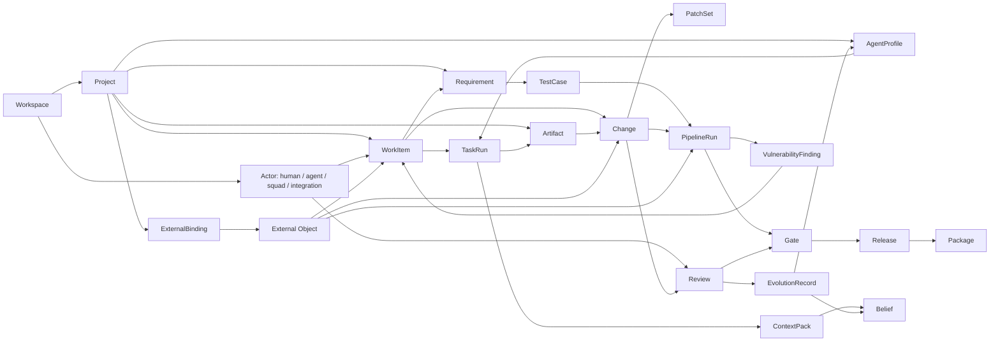

# Human-Agent Platform Functional Requirements

This document is a full product requirements map, not an MVP plan.

The goal is to extract the collaboration concepts behind Redmine, Multica,
Gerrit, and GitLab, then turn them into platform functions for managing large
projects where humans and agents work together. Existing systems are treated as
concept references, not as products to copy one-to-one.

## 中文范围定义

这份文档讨论的是一个大型项目里的 human-agent 协作控制面，而不是把
Redmine、Multica、Gerrit、GitLab 拼成一个导航入口。目标是把这些系统
背后的产品概念抽象出来，变成统一的平台能力。

- Redmine 提供“人与人的课题追踪、角色、流程、知识沉淀、时间和计划”
  的参考。
- Multica 提供“agent 作为一等队员、任务执行、runtime、skills、squads、
  project resources、autopilot、上下文注入”的参考。
- Gerrit 提供“任何成果物都可以被严肃评审、打分、迭代 patch set、满足
  submit requirements 后再发布”的参考。
- GitLab 提供“可绑定的代码、MR、CI、环境、发布、包、漏洞、安全门禁和
  项目操作面”的参考。平台不需要替代 GitLab，而是像 Codex 绑定 GitHub
  一样，把 GitLab 作为外部 source-of-truth、执行系统和证据来源接入。

因此平台的核心不是“复刻四个平台”，而是沉淀这些能力：

| 中文能力域 | 含义 |
|---|---|
| 项目和课题管理 | 管理人、agent、项目、工作项、里程碑、版本、时间、知识和依赖关系。 |
| Agent 管理 | 管理 agent 身份、runtime、任务、队列、skills、上下文、squad、自动运行和成本。 |
| 上下文管理 | 管理 system prompt、project prompt、skills、知识源、资源指针、信任层级、上下文版本和证据。 |
| 成果物管理 | 把代码、文档、Markdown、RST、prompt、skill、policy、报告、包、发布物都当作可追踪成果物。 |
| 评审和门禁 | 把 Gerrit 式 patch set、review label、attention set、submit requirement 扩展到所有 AI 成果物。 |
| 验证和发布 | 把 GitLab 式 CI/CD、环境、发布、包、漏洞扫描、安全发现和人工审批抽象成验证与发布控制面。 |
| 治理和演化 | 保证人类保留关键决策权，同时把纠错、复盘、重复流程沉淀为 prompt、skill、policy 和知识更新。 |

## 中文调查结论

这四类系统分别代表大型项目协作里的四种“秩序”。新平台应该抽取秩序，
而不是照搬界面。

| 来源系统 | 它真正解决的问题 | 应抽象成的平台能力 | 不应照搬的部分 |
|---|---|---|---|
| Redmine | 让多人围绕课题、角色、状态、字段、计划、时间和知识进行长期协作。 | WorkItem、Tracker-like type、workflow matrix、custom fields、relations、roadmap、time tracking、wiki/files/news/forums。 | 不应只复刻传统 issue tracker；agent 的任务、上下文、成果物评审和演化必须进入同一工作图谱。 |
| Multica | 让 agent 作为工作区成员参与项目，有任务、runtime、skills、squads、project resources、autopilot 和 inbox 语义。 | AgentProfile、TaskRun、Runtime、Skill、Squad、Autopilot、ContextPack、agent mention、agent lead。 | 不应只做 agent 聊天入口；必须把 agent 行动变成可审计、可取消、可评审、可学习的项目事件。 |
| Gerrit | 让变更以 patch set 迭代、被多人评论和打分，满足 submit requirements 后才能进入受保护目标。 | Change、PatchSet、Review、ReviewLabel、AttentionSet、SubmitRequirement、SuggestedFix、WIP/private change。 | 不应局限在代码 review；Markdown、RST、prompt、skill、policy、报告、图表等 AI 成果物也需要同样严肃的评审模型。 |
| GitLab | 把代码、MR、CI、环境、发布、包、安全扫描、漏洞和项目运营连成一体化交付面。 | GitLabBinding、ExternalObject、PipelineEvidence、ProtectedTarget、ReleaseMirror、PackageMirror、RequirementLink、VulnerabilityFinding。 | 不应试图复制或替代全套 DevOps 套件；应通过绑定、同步、深链、受控写回和证据采集使用 GitLab。 |

综合来看，human-agent 平台的核心判断是：

- Agent 不是普通自动化脚本，也不是普通用户。它是可分配、可评论、可执行、
  可失败、可被治理的 actor。
- 课题不是唯一中心。大型项目真正需要的是 WorkItem、ContextPack、
  Artifact、Change、Review、Pipeline、Release、EvolutionRecord 组成的图谱。
- 评审不应只评代码。AI 产出的文档、prompt、skill、policy、研究报告、
  RST/Markdown、测试计划、发布说明和知识更新都应进入可版本化评审流。
- 上下文是产品对象。系统提示词、技能、项目资源、知识、外部快照、证据和
  人类纠错都需要版本、来源、权限、信任等级和过期机制。
- human-in-loop 不是每一步都找人点确认，而是在高风险、高影响、不可逆、
  外部可见、改变未来 agent 行为的地方保留明确的人类授权和责任链。
- 演化必须经过评审。人类纠错、失败复盘和成功工作流可以沉淀为 skill、
  prompt、policy、belief 或 validation，但不能静默改变未来 agent 行为。

## 不照搬原则和设计张力

| 设计张力 | 平台取舍 |
|---|---|
| 传统项目管理 vs agent 执行系统 | WorkItem 管理意图和责任，TaskRun 管理一次 agent 执行，两者必须分离但互相链接。 |
| 聊天体验 vs 可审计项目事件 | Chat 可以存在，但重要结果必须能提升为 WorkItem、Artifact、Change、Belief 或 EvolutionRecord。 |
| 自动化效率 vs 人类授权 | 低风险动作可自动化，高风险动作走 proposal、review、gate、approval 和 audit。 |
| 上下文丰富 vs 上下文安全 | ContextPack 应该足够完整，但必须有脱敏、信任层级、来源、权限和 prompt injection 防护。 |
| Agent 自主协作 vs 循环失控 | Squad 和 agent handoff 需要 leader protocol、anti-loop、routing record 和 human escalation。 |
| GitLab 绑定 vs 平台原生能力 | GitLab 应优先作为外部 source-of-truth 和执行/证据系统绑定；Redmine-style 课题管理和 Gerrit-style 评审机制则是平台需要原生实现的核心能力。 |
| 一次性交付 vs 持续演化 | 需求母表必须覆盖从创建、执行、评审、验证、发布到纠错沉淀的完整闭环。 |

## Research Sources

Primary sources used for concept extraction:

- Multica: official GitHub README and product docs for workspaces, members,
  issues, agents, skills, squads, daemons, tasks, and autopilots.
- Redmine: official issue tracking, workflow, REST API, issue relations,
  watchers, journals, custom fields, and permissions documentation.
- Gerrit: official changes, patch sets, review labels, submit requirements, and
  attention set documentation.
- GitLab: official issue boards, milestones, merge requests, approvals, Code
  Owners, protected branches, CI/CD pipelines, and CI jobs documentation.
- Agent Skills: official `SKILL.md` open format and progressive disclosure
  documentation.

Representative links:

- Multica README: https://github.com/multica-ai/multica
- Multica docs: https://multica.ai/docs
- Multica comments: https://multica.ai/docs/comments
- Multica mentioning agents: https://multica.ai/docs/mentioning-agents
- Multica project resources: https://multica.ai/docs/project-resources
- Multica chat: https://multica.ai/docs/chat
- Multica inbox: https://multica.ai/docs/inbox
- Multica skills: https://multica.ai/docs/skills
- Multica squads: https://multica.ai/docs/squads
- Redmine features: https://www.redmine.org/projects/redmine/wiki/Features
- Redmine issue tracking: https://www.redmine.org/projects/redmine/wiki/redmineissuetrackingsetup
- Redmine issues: https://www.redmine.org/projects/redmine/wiki/redmineissues
- Redmine project settings: https://www.redmine.org/projects/redmine/wiki/RedmineProjectSettings
- Redmine custom fields: https://www.redmine.org/projects/redmine/wiki/RedmineCustomFields
- Redmine roles: https://www.redmine.org/projects/redmine/wiki/RedmineRoles
- Redmine roadmap: https://www.redmine.org/projects/redmine/wiki/RedmineRoadmap
- Redmine calendar: https://www.redmine.org/projects/redmine/wiki/RedmineCalendar
- Redmine REST API: https://www.redmine.org/projects/redmine/wiki/rest_api
- Gerrit changes: https://gerrit-review.googlesource.com/Documentation/concept-changes.html
- Gerrit patch sets: https://gerrit-review.googlesource.com/Documentation/concept-patch-sets.html
- Gerrit review UI: https://gerrit-review.googlesource.com/Documentation/user-review-ui.html
- Gerrit attention set: https://gerrit-review.googlesource.com/Documentation/user-attention-set.html
- Gerrit review labels: https://gerrit-review.googlesource.com/Documentation/config-labels.html
- Gerrit submit requirements: https://gerrit-review.googlesource.com/Documentation/config-submit-requirements.html
- Gerrit cross-repository topics: https://gerrit-review.googlesource.com/Documentation/cross-repository-changes.html
- Gerrit access controls: https://gerrit-review.googlesource.com/Documentation/access-control.html
- GitLab issue boards: https://docs.gitlab.com/user/project/issue_board/
- GitLab work items: https://docs.gitlab.com/user/work_items/
- GitLab labels: https://docs.gitlab.com/user/project/labels/
- GitLab epics: https://docs.gitlab.com/user/group/epics/
- GitLab milestones: https://docs.gitlab.com/user/project/milestones/
- GitLab merge requests: https://docs.gitlab.com/user/project/merge_requests/
- GitLab approval rules: https://docs.gitlab.com/user/project/merge_requests/approvals/rules/
- GitLab Code Owners: https://docs.gitlab.com/user/project/codeowners/
- GitLab protected branches: https://docs.gitlab.com/user/project/repository/branches/protected/
- GitLab CI/CD pipelines: https://docs.gitlab.com/ci/pipelines/
- GitLab CI jobs: https://docs.gitlab.com/ci/jobs/
- GitLab scheduled pipelines: https://docs.gitlab.com/ci/pipelines/schedules/
- GitLab environments: https://docs.gitlab.com/ci/environments/
- GitLab protected environments: https://docs.gitlab.com/ci/environments/protected_environments/
- GitLab deployment approvals: https://docs.gitlab.com/ci/environments/deployment_approvals/
- GitLab CI cache: https://docs.gitlab.com/ci/caching/
- GitLab branch rules: https://docs.gitlab.com/user/project/repository/branches/branch_rules/
- GitLab CODEOWNERS reference: https://docs.gitlab.com/user/project/codeowners/reference/
- GitLab requirements management: https://docs.gitlab.com/user/project/requirements/
- GitLab test cases: https://docs.gitlab.com/ci/test_cases/
- GitLab releases: https://docs.gitlab.com/user/project/releases/
- GitLab package registry: https://docs.gitlab.com/user/packages/package_registry/
- GitLab dependency scanning: https://docs.gitlab.com/user/application_security/dependency_scanning/
- GitLab vulnerabilities: https://docs.gitlab.com/user/application_security/vulnerabilities/
- GitLab snippets: https://docs.gitlab.com/user/snippets/
- Agent Skills specification: https://agentskills.io/specification

## Concept Extraction

| Source | Native concept | Platform abstraction |
|---|---|---|
| Redmine | Issue, tracker, status, workflow, role permissions | Human-readable work item system with type-specific workflows and role-gated state changes |
| Redmine | Journals, comments, watchers, associated revisions | Durable collaboration timeline with observers, provenance, and external evidence |
| Redmine | Subtasks, related issues, duplicates, precedes/follows | Work graph with dependency, duplication, decomposition, and scheduling semantics |
| Redmine | Custom fields and field permissions | Configurable schema per work type, state, and actor role |
| Redmine | Versions, roadmap, Gantt, calendar | Goal, release, date, and dependency planning over work items |
| Redmine | Time entries and timelog reports | Human and agent effort accounting with work-type and activity breakdowns |
| Redmine | Project modules | Per-project capability switches and information architecture |
| Redmine | Wiki, forums, news, documents, files | Project knowledge and discussion surfaces tied to permissions |
| Redmine | Repository browser, diff viewer, annotate/blame | Evidence navigation for source-linked work and artifact review |
| Multica | Workspace, member, role, issue, project | Shared operating space for humans and agents |
| Multica | Agent as assignee, commenter, project lead | Agent as first-class actor, not a hidden tool call |
| Multica | Runtime, daemon, task state machine | Observable execution layer for agent work |
| Multica | Skills, system instructions, custom args/env | Governed capability and context packaging |
| Multica | Squads and leader agent routing | Multi-agent team topology and delegation protocol |
| Multica | Autopilots | Standing orders for scheduled, webhook, or manual recurring agent work |
| Multica | Chat | Private sandboxed agent conversation outside shared work items |
| Multica | Project resources | Typed project context pointers injected into agent runs |
| Multica | Inbox and subscriptions | Human notification layer separate from agent trigger semantics |
| Gerrit | Change, Change-Id, patch set | Versioned artifact proposal with iterative review history |
| Gerrit | Review labels, votes, submit requirements | Configurable approval and gate mechanism |
| Gerrit | Attention set | Explicit turn-taking and responsibility routing |
| Gerrit | Related changes, topics, submitted together | Review graph for dependent or grouped artifact changes |
| Gerrit | Private and Work-in-Progress changes | Reduced visibility and not-ready-for-review states |
| Gerrit | Draft comments and publish reply | Two-phase review feedback: private drafting then public review event |
| Gerrit | Suggested fixes and change edits | Review feedback that can create a new artifact revision |
| Gerrit | Rebase, cherry-pick, revert, abandon, restore | Controlled lifecycle actions over proposed changes |
| GitLab | Issue boards, labels, milestones | Visual planning and release/timebox tracking |
| GitLab | Merge request, approvals, open threads | Collaborative change review with blocking discussion resolution |
| GitLab | Code Owners and protected branches | Ownership-based gate policy for sensitive areas |
| GitLab | Pipelines, jobs, stages, artifacts, logs | Automated validation and evidence production |
| GitLab | Work items, epics, tasks, objectives, key results | Unified planning objects with hierarchy and lateral relationships |
| GitLab | Scoped labels | Mutually exclusive metadata dimensions for workflows and classification |
| GitLab | Environments and deployment approvals | Runtime target protection and manual gate for release operations |
| GitLab | Pipeline schedules, inputs, variables, cache | Recurring validation, parameterized execution, and performance state |
| GitLab | Branch rules, protected branches, external status checks | Policy bundles for target protection, approvals, and validation requirements |
| GitLab | Requirements and test cases | Long-lived product criteria with test evidence and satisfaction state |
| GitLab | Releases, release assets, deploy freeze | Controlled publication, release evidence, and release-window governance |
| GitLab | Package registry and container registry | Distribution surface for versioned deliverables and downstream dependencies |
| GitLab | Dependency scanning, SBOM, vulnerabilities | Security findings as first-class work, review, and gate inputs |
| GitLab | Snippets | Small multi-file artifacts with comments, visibility, cloning, and API access |
| Agent Skills | `SKILL.md`, scripts, references, assets | Portable, versioned capability package with progressive context loading |

## Detailed Mechanism Notes

### Redmine-Derived Work Management

- Work type is not merely a label. In Redmine, trackers determine default
  status, available fields, roadmap visibility, and workflow. The platform
  should copy this idea as type-governed work schema for both human and agent
  work.
- Workflow is a role/type/status matrix. A user may be able to move one type
  from New to Assigned, but not from Assigned to Closed. Human-agent platforms
  need this granularity because agent transitions are higher risk than human
  transitions.
- Fields have lifecycle permissions. A field can be required or read-only for a
  specific role and status. This maps directly to mandatory evidence, required
  acceptance criteria, frozen context, and locked artifact metadata.
- Versions and roadmap represent planning memory. They connect issues, due
  dates, wiki pages, percent complete, and release status. The platform should
  treat releases and milestones as context-bearing project objects, not only
  dates.
- Watchers, journals, and associated revisions create the human collaboration
  record. This becomes the baseline for agent-readable timelines with evidence
  provenance and subscriber control.

### Multica-Derived Agent Operations

- An agent is an actor in the workspace surface. It can be assigned, mentioned,
  comment, lead projects, and open issues, but its execution still happens as a
  task bound to a runtime.
- Assignment and mention are different delegation semantics. Assignment gives
  ownership; mention creates a lighter task that sees the issue and trigger
  comment without changing assignee or status.
- Agents do not read inboxes. Humans receive notifications; agents are triggered
  by assignment, mention, chat, or standing-order execution. This distinction is
  central to avoiding fake human metaphors.
- Project resources are typed context pointers. Repos, local directories, docs,
  and future resources should be attached to projects and injected into agent
  runs through both structured files and concise prompt summaries.
- Chat is private and sandboxed. It is useful for exploration but must not have
  the same authority or context access as issue-bound work.
- Squads separate routing from execution. A leader agent can decide who should
  respond, while specialist agents or humans do the work.

### Gerrit-Derived Review Mechanics

- Patch sets are review memory. Each iteration can be compared with prior
  iterations, and comments can be checked against the new state. This is the
  right model for AI-generated documents, prompts, skills, runbooks, and code.
- Review feedback has a draft/publish phase. Reviewers can prepare inline
  comments privately, then publish comments and votes in one reply event.
- Labels are not just approvals. They are typed judgments. Code-Review,
  Verified, Security, Prompt Safety, and Documentation Quality can each have
  their own voting values and submit requirements.
- Attention set is the "whose turn is it" model. It should apply to humans,
  agents, and squads so work does not become hidden in long comment threads.
- Topics and Submitted Together support atomic multi-artifact change sets. This
  matters when a prompt, skill, doc, test, and code change must land together.
- Private and Work-in-Progress states give authors a way to prepare changes
  before full review. AI artifacts need the same distinction.

### GitLab-Derived Planning And Validation

- Work items unify planning objects. Issues, tasks, epics, incidents,
  objectives, key results, and test cases suggest that human-agent work should
  not force every object into one "ticket" shape.
- Scoped labels provide lightweight structured state. Mutually exclusive label
  families such as `workflow::in-review` or `risk::high` are useful before a
  full custom field is justified.
- Boards and swimlanes support multiple planning views over the same work graph.
  The human-agent platform should not assume one canonical board.
- Merge approval and Code Owners demonstrate expertise-based gates. For this
  platform, ownership should apply to artifact type, project domain, path,
  knowledge area, prompt family, skill, and runtime capability.
- Pipelines produce evidence. Jobs, logs, artifacts, caches, schedules,
  environments, and approvals should generalize into artifact validation and
  rollout gates.
- Protected environments and deployment approvals generalize to protected
  execution targets: production, customer data, privileged tools, workspace-wide
  skills, global prompts, and external write adapters.
- Branch rules combine branch protection, approval rules, CODEOWNERS behavior,
  squash policy, and external status checks into a single effective protection
  surface. The platform should generalize that to any protected artifact target.
- Requirements and test cases are long-lived criteria with evidence status. In
  a human-agent platform, they become the bridge between product intent,
  generated artifacts, validation jobs, and human acceptance.
- Releases and package registries show that publication is itself a workflow,
  not a final button. Published deliverables need assets, permissions,
  provenance, storage controls, downstream consumers, and rollback paths.
- Security scans and vulnerability records show how validation outputs become
  durable work objects. A vulnerability, hallucination, unsafe skill, or bad
  prompt should have severity, status, owner, evidence, and remediation flow.

### GitLab Binding Model

GitLab does not need to be replaced by this platform. The preferred model is a
connector-like binding, similar to how Codex binds to GitHub:

- GitLab remains source of truth for repositories, merge requests, branches,
  pipelines, jobs, environments, releases, packages, and vulnerabilities when a
  team already uses GitLab.
- The platform stores bound external objects, snapshots, evidence, policy
  decisions, context references, review links, and human-agent audit trails.
- Agent actions against GitLab should go through scoped mediation: read,
  summarize, propose, comment, open MR, request review, trigger pipeline, or
  prepare release actions according to policy.
- Native platform objects are still needed for agent context, non-code AI
  artifacts, cross-system review, policy, memory, and evolution records that do
  not naturally live inside GitLab.
- A future implementation can start with read-only binding and deep links, then
  add write-back for comments, MRs, pipeline triggers, labels, releases, or
  vulnerability status only where governance permits.
- This GitLab binding decision does not change the product role of Redmine and
  Gerrit concepts: Redmine-style work tracking and Gerrit-style review are
  native platform capability areas. Connecting an existing Redmine or Gerrit
  installation is a separate migration/synchronization choice, not the default
  interpretation of those capabilities.

## Platform Product Model

The platform should be understood as a Human-Agent Work OS for large projects.
Its primary managed objects are:

- Workspace: tenant and collaboration boundary.
- Project: durable delivery area inside a workspace.
- Actor: human, agent, squad, service account, or external integration.
- ExternalBinding: configured relationship to GitLab/GitHub-like external
  projects, repositories, CI systems, registries, security scanners, or another
  explicitly chosen external source. This object models integration; it does
  not replace the native WorkItem and Review capabilities extracted from
  Redmine and Gerrit.
- WorkItem: issue-like unit of work with type, status, ownership, timeline, and
  relations.
- AgentProfile: governed identity, runtime binding, capabilities, permissions,
  prompts, skills, and limits.
- ContextPack: versioned, evidence-backed working context injected into agent
  runs.
- Artifact: any human or AI output, including code, Markdown, RST, diagrams,
  prompts, skills, configs, test plans, runbooks, and reports.
- Change: proposed modification to one or more artifacts.
- PatchSet: one iteration of a change.
- Review: human or agent assessment of a change, with comments, labels, gates,
  and required approvals.
- TaskRun: one concrete agent execution.
- Gate: policy, approval, or automated validation condition.
- Requirement: long-lived product, system, compliance, or process criterion with
  status and verification evidence.
- TestCase: reusable validation scenario linked to requirements, artifacts,
  pipelines, and human acceptance.
- Release: governed publication event containing artifacts, packages, notes,
  approvals, validation evidence, and rollback metadata.
- Package: distributed deliverable or dependency with version, provenance,
  visibility, consumers, and retention policy.
- VulnerabilityFinding: security, safety, quality, or agent-behavior finding
  with severity, evidence, owner, status, and remediation links.
- Belief: evidence-backed, scoped, expirable project memory.
- EvolutionRecord: durable record of a correction, lesson, skill update, prompt
  update, policy update, or new validation rule.

## Core Object Relationship Map

This relationship map is a product model, not a database schema. It shows the
minimum graph needed for human-agent work to stay reviewable, explainable, and
evolvable.

## Critical Closed Loops

The platform is only coherent if these loops stay connected. Later MVP slicing
can reduce depth inside a loop, but should not sever the loop entirely.

| Loop | Minimal chain | Why it matters |
|---|---|---|
| Work-to-agent loop | WorkItem -> AgentProfile -> TaskRun -> ContextPack -> Artifact/Comment -> WorkItem timeline | Agent work must be assignable, observable, cancellable, and attributable. |
| Artifact review loop | Artifact -> Change -> PatchSet -> Review -> Gate -> Release/Publish | AI outputs need the same iterative review rigor as code, including non-code artifacts. |
| Evidence and validation loop | Requirement/TestCase -> PipelineRun -> evidence -> Gate -> Review/Release | Humans need inspectable evidence before trusting or publishing agent output. |
| Governance loop | Actor -> policy decision -> approval/proposal -> external write/release -> audit event | Risky actions must preserve human authority, source-of-truth rules, and accountability. |
| Evolution loop | Review correction/failure -> EvolutionRecord -> Belief/Prompt/Skill/Policy update -> future ContextPack | The system should improve from human correction without silently mutating future agent behavior. |

## Object Lifecycle Model

The platform should make lifecycle state explicit. Human-agent systems fail when
work, context, review, and publication are hidden inside chats or implicit tool
side effects.

| Object | Typical states | Entry trigger | Exit or terminal condition | Human-in-loop meaning |
|---|---|---|---|---|
| WorkItem | backlog, todo, in progress, blocked, waiting for human, waiting for agent, in review, waiting for pipeline, done, cancelled, archived | Human creation, agent-created follow-up, external import, autopilot create-issue mode | Done, cancelled, or archived with timeline preserved | Humans decide whether work is real, accepted, cancelled, or escalated. |
| TaskRun | queued, dispatched, running, waiting, completed, failed, timed out, cancelled, superseded | Assignment, mention, chat, webhook, schedule, review request, manual rerun | Completed, failed after retries, cancelled, or superseded | Agent execution is observable and interruptible; quality rerun is distinct from infrastructure retry. |
| ContextPack | draft, compiled, delivered, redacted, stale, conflicted, archived | Task dispatch, review request, replay, validation job | Delivered to a run, rejected due to policy, or superseded by a newer pack | Reviewers can inspect what the agent saw and challenge stale or unsafe context. |
| Artifact | draft, proposed, in review, approved, published, deprecated, superseded, archived, rejected | Human or agent output becomes registered | Published, rejected, superseded, deprecated, or archived | AI output becomes a managed object, not an unreviewed chat answer. |
| Change | draft, WIP, private, reviewable, needs changes, approved, submitted, abandoned, restored, superseded | Artifact modification proposal | Submitted/published, abandoned, or superseded | Gerrit-style iteration applies to docs, prompts, skills, policy, and code. |
| Review | pending, active, waiting on author, waiting on reviewer, blocked, approved, changes requested, rejected, closed | Change enters reviewable state or reviewer is requested | Approved, rejected, closed, or superseded by policy | Attention routing makes "whose turn is it" visible for humans and agents. |
| PipelineRun | created, pending, running, manual action required, failed, passed, cancelled, skipped, expired | Change, schedule, webhook, manual trigger, policy event | Passed, failed, cancelled, skipped, or expired | Automated evidence can block publication but should explain its decision. |
| Gate | inactive, evaluating, passed, failed, waived, overridden, expired | Review, pipeline, policy, release, or external write event | Passed, failed, waived, overridden, or expired | Humans can see which rule blocks action and who can override it. |
| Release | draft, candidate, frozen, approved, published, failed, rolled back, deprecated, archived | Approved changes assembled for publication | Published, rolled back, deprecated, or archived | Publication is a governed event with evidence and rollback, not a button press. |
| Package | draft, staged, published, yanked, deprecated, superseded, deleted | Release or package publish job | Published, yanked, deprecated, superseded, or deleted under audit | Distributed deliverables remain traceable after downstream use begins. |
| VulnerabilityFinding | detected, triaged, confirmed, false positive, accepted risk, fix proposed, fixed, verified, reopened | Scanner, continuous rescan, manual report, agent safety finding | Fixed and verified, accepted with expiry, or false positive | Safety/security findings become work with owner, severity, evidence, and approval rules. |
| Skill or Prompt | draft, proposed, in review, test failed, approved, canary, active, rolled back, deprecated, archived | Human edit, agent proposal, correction promotion, process mining | Active, rolled back, deprecated, or archived | Changes to agent behavior require stronger review because they alter future work. |
| Belief | draft, accepted, disputed, stale, corrected, expired, archived | Human correction, agent observation, imported knowledge, review result | Corrected, expired, archived, or superseded | Memory stays evidence-backed and reversible instead of becoming folklore. |
| EvolutionRecord | captured, clustered, proposed, reviewed, adopted, rejected, monitored, retired | Correction, retrospective, review pattern, repeated task success/failure | Adopted into skill/prompt/policy/resource or rejected with reason | Learning is explicit, reviewed, and measured. |

### State Transition Principles

- State transitions must be caused by a named actor or policy event and recorded
  in the timeline.
- Agent-triggered transitions should be policy-bound and reversible unless the
  action is explicitly low risk.
- Any state that blocks human work should expose owner, reason, next action, and
  SLA.
- WIP/private states reduce review pressure but do not remove auditability.
- Terminal states should preserve history; deletion is an administrative and
  compliance question, not a normal collaboration operation.

## Human-Agent Authority Matrix

This is a conceptual authority matrix for product design. Actual permissions
must remain configurable by workspace, project, artifact class, risk, and
external source-of-truth policy.

| Action area | Ordinary member | Project lead | Reviewer/approver | Agent operator | Agent | Workspace admin | Auditor |
|---|---|---|---|---|---|---|---|
| Create work item | Yes | Yes | Yes | Yes | Policy-bound | Yes | No |
| Assign work to human | Limited | Yes | Limited | Limited | Policy-bound suggestion | Yes | No |
| Assign work to agent | If allowed by agent visibility | Yes | Limited | Yes | No self-escalation | Yes | No |
| Mention agent or squad | Yes, rate-limited | Yes | Yes | Yes | Policy-bound | Yes | No |
| Create or edit project resource | Limited | Yes | Limited | Limited | Proposal only unless low risk | Yes | Read |
| Edit agent system prompt | No | Proposal | Review/approve | Proposal/edit if delegated | Proposal only | Yes with review | Read/audit |
| Attach third-party skill | No | Proposal | Review/approve | Proposal/edit if delegated | No | Yes with supply-chain review | Read/audit |
| Run agent task | If policy allows | Yes | Review-specific | Yes | No self-start outside triggers | Yes | No |
| Cancel agent task | Own task or assigned work | Project scope | Review scope | Runtime scope | No | Yes | No |
| Create artifact change | Yes | Yes | Yes | Yes | Policy-bound | Yes | No |
| Approve artifact change | No self-approval | If owner and policy allows | Yes | Only if configured | Advisory or policy-bound | Emergency/owner override | No |
| Override gate | No | Limited with reason | Limited if approver | No | No | Yes with reason/expiry | No |
| Publish release/package | No | With required gates | Approval only | No | Proposal only | Yes with gates | No |
| Write external system | No direct broad writes | Through mediated proposal | Approval only | Through scoped mediator | Through scoped mediator and policy | Configure mediator | Read/audit |
| Change policy | Proposal | Proposal | Review/approve | Proposal | No | Yes with review | Read/audit |
| View audit and evidence | Own/project allowed | Project scope | Review scope | Runtime/task scope | Own task evidence only | Workspace scope | Workspace or compliance scope |

### Authority Principles

- Agents should be treated as actors for traceability, but not as humans for
  authority. They act through delegated and policy-mediated authority.
- Human approval should be required when an action is irreversible, externally
  visible, privileged, expensive, privacy-sensitive, or behavior-changing for
  future agents.
- Review and approval are different actions. A reviewer may provide evidence or
  advisory labels without being allowed to satisfy a human approval gate.
- Emergency override is a product feature, not a backdoor. It needs reason,
  scope, expiry, audit trail, and ideally retrospective review.
- Auditors should not need broad mutation rights to reconstruct what happened.

## Capability Domains

| Domain | Name | Purpose |
|---|---|---|
| ORG | Workspace, project, identity, and access | Define who and what can participate |
| WORK | Work item and project tracking | Manage human and agent work at large-project scale |
| AGT | Agent lifecycle and multi-agent collaboration | Create, configure, assign, observe, and retire agents |
| CTX | Context, prompts, skills, and knowledge | Control what agents know and how that knowledge evolves |
| ART | Artifact and change management | Treat AI outputs as reviewable, versioned products |
| REV | Review, approval, and attention routing | Apply Gerrit-like rigor beyond code |
| PIPE | Validation, pipelines, and evidence | Verify outputs with automated checks and reusable gates |
| REL | Release, package, and distribution | Bind, mirror, publish, distribute, freeze, rollback, and retire deliverables |
| GOV | Human-in-loop governance, safety, and audit | Keep humans accountable and agents bounded |
| EVO | Learning, correction, and evolution | Turn good outcomes and failures into durable improvement |
| INT | Integrations and interoperability | Connect external systems without making them the product core |
| OPS | Operations, observability, and administration | Run the platform safely at team and enterprise scale |

## 中文需求母表索引

下面这张表是给中文产品讨论用的入口。详细条目仍以
`Functional Requirements Table` 为准；这里负责说明每个编号段代表什么，
避免后续讨论 MVP、PRD 或信息架构时迷路。

| 编号段 | 条目数 | 中文能力说明 | 主要回答的问题 |
|---|---:|---|---|
| ORG-001..ORG-018 | 18 | 组织、项目、身份、权限、委托和可见性。 | 谁能参与？谁能看见？谁能代表谁行动？权限如何继承和审计？ |
| WORK-001..WORK-039 | 39 | 课题、需求、测试用例、里程碑、路线图、时间、评论、依赖和知识面。 | 人和 agent 围绕什么工作？工作如何分解、追踪、计划、验收？ |
| AGT-001..AGT-039 | 39 | Agent 身份、runtime、任务、状态机、chat、autopilot、squad、成本和能力矩阵。 | agent 如何被创建、分配、触发、协作、失败、重跑和退役？ |
| CTX-001..CTX-032 | 32 | 上下文包、prompt、skill、project resources、知识、信任层级、脱敏和冲突处理。 | agent 到底看见了什么？哪些内容可作为指令？上下文如何演化和追溯？ |
| ART-001..ART-023 | 23 | 成果物、变更、patch set、非代码 diff、预览、仓库浏览、snippet 和来源追踪。 | AI 产出的代码、文档、prompt、skill、报告等如何成为可版本化产品？ |
| REV-001..REV-032 | 32 | Gerrit 式评审、label、attention set、submit requirement、draft comment、WIP/private change 和建议修复。 | 谁来评？评什么？谁该下一步行动？什么条件满足后才能发布？ |
| PIPE-001..PIPE-031 | 31 | pipeline、job、日志、证据包、环境、cache、SBOM、安全扫描、持续扫描和 gate explainability。 | 自动验证如何证明成果可信？失败、漏洞和缺证据时如何阻断？ |
| REL-001..REL-012 | 12 | release、release assets、release notes、package registry 绑定、模型/容器/通用包镜像、下游消费者、保留和回滚。 | 通过评审的成果如何绑定到外部发布面、分发、冻结、追踪消费者、回滚和退役？ |
| GOV-001..GOV-030 | 30 | human-in-loop 策略、风险、审批、证据、最小权限、供应链、protected target 和漏洞生命周期。 | 哪些事 agent 可独立做？哪些必须人类审批？风险和责任链如何闭环？ |
| EVO-001..EVO-018 | 18 | 纠错捕获、skill/prompt 演化、评审意见沉淀、scorecard、知识债和退役。 | 人类纠错和成功经验如何变成长期组织能力？ |
| INT-001..INT-021 | 21 | GitLab/GitHub/chat/CI/registry/security 等外部系统绑定；如团队已有 Redmine/Gerrit 存量实例，可另做迁移或同步适配。 | 平台如何绑定必要外部系统，同时保留原生课题管理、评审、事件、证据、上下文和演化对象？ |
| OPS-001..OPS-022 | 22 | 队列、runtime、通知、审计、备份、迁移、观测、成本、存储、registry audit 和 runbook。 | 平台如何被安全、稳定、可审计地运行？ |

## Requirement Row Semantics

Each requirement row is intentionally written as a product capability, not a UI
screen and not an implementation task.

| Field | Meaning | Usage rule |
|---|---|---|
| ID | Stable requirement identifier. | IDs should not be reused after deletion; later prioritization can add priority/status columns without changing IDs. |
| Domain | Capability area. | Domains are product boundaries, not engineering team names. |
| Feature | Short functional concept. | Feature names should remain human-readable and searchable. |
| Requirement | Platform-level requirement. | A row should state what the platform must support, not how one existing tool implements it. |
| Main concept source | Source concept that inspired the abstraction. | This is traceability evidence, not an instruction to clone that source. |

## 后续切片规则

这份表是完整需求母表。后续讨论 MVP、版本路线或交付计划时，应该从这里切片，
而不是重写一个更窄的问题定义。

- 先按风险链路切：agent 行动、上下文、成果物、评审、验证、审批、发布必须能形成闭环。
- 再按角色切：项目负责人、人类 reviewer、agent operator、workspace admin、auditor 都要有可完成的核心流程。
- 再按成果物切：代码、Markdown/RST 文档、prompt、skill、policy、报告至少要覆盖代表性的非代码评审路径。
- 再按外部系统切：GitLab 可以先做只读绑定和深链，再逐步增加受控写回；Redmine-style 课题管理和 Gerrit-style 评审是平台原生能力，只有连接已有 Redmine/Gerrit 实例才属于可选集成。
- 切 MVP 时可以推迟某些域的深度，但不能删除母表里的概念；被推迟的项应标记为 later、blocked、research 或 out-of-scope。

## PRD Decomposition Template

Every future PRD or engineering design derived from this mother table should
include the following fields. This keeps later work tied to the full objective
instead of drifting into a narrow task-board clone.

| PRD field | Required content |
|---|---|
| Requirement IDs | List the exact ORG/WORK/AGT/CTX/ART/REV/PIPE/REL/GOV/EVO/INT/OPS IDs covered. |
| User roles | Name the human and agent actors involved, including approver, reviewer, operator, auditor, and delegated actor when relevant. |
| Managed objects | Identify which core objects are created, read, updated, reviewed, published, archived, or exported. |
| Lifecycle states | Name the state transitions and terminal states touched by the feature. |
| Context and evidence | Describe what context is compiled, what evidence is required, and what must be inspectable later. |
| Permission model | State who can perform the action, who can approve it, who can override it, and who can audit it. |
| Review and gate behavior | Specify labels, submit requirements, pipeline checks, manual approvals, and failure explanations. |
| External source of truth | Declare whether the platform or an external system owns each field, state, comment, vote, artifact, or side effect. |
| Failure and rollback | Define retry, rerun, cancellation, rollback, deprecation, dead-letter, and conflict behavior. |
| Evolution hook | State whether corrections or repeated success can become a belief, prompt, skill, policy, resource, or validation update. |

### Product Depth Levels

Depth levels are not MVP priorities. They are a vocabulary for later roadmap
discussion after this full map exists.

| Level | Meaning | Example |
|---|---|---|
| L0 Reference | Imported or linked external state only. | Read-only Redmine issue link, Gerrit change link, GitLab project/pipeline status. |
| L1 Native Record | Platform stores its own object and timeline. | Native WorkItem, TaskRun, ContextPack, Artifact. |
| L2 Governed Workflow | Object has permissions, lifecycle, review, gates, and audit. | Prompt change review, skill approval, protected release. |
| L3 Automated Assistance | Agents can propose, route, validate, summarize, or execute within policy. | Squad routing, review bot, release note drafting. |
| L4 Learning System | Repeated outcomes improve skills, prompts, policies, or knowledge through review. | Correction clustering becomes a new reviewed skill. |

## Functional Requirements Table

| ID | Domain | Feature | Requirement | Main concept source |
|---|---|---|---|---|
| ORG-001 | ORG | Workspace boundary | The platform shall support isolated workspaces containing members, agents, projects, issues, artifacts, settings, and audit logs. | Multica workspace |
| ORG-002 | ORG | Workspace slug and issue prefix | Each workspace shall have stable URL identity and stable work item numbering that does not break historical references. | Multica issue prefix |
| ORG-003 | ORG | Project hierarchy | The platform shall support projects, subprojects, and grouped delivery areas with leads, members, agents, and project-specific policies. | Redmine projects, GitLab groups |
| ORG-004 | ORG | Member roles | The platform shall define owner, admin, member, reviewer, approver, operator, auditor, and guest-like roles. | Multica roles, GitLab roles |
| ORG-005 | ORG | Role permission matrix | Every sensitive action shall be gated by a role permission matrix, including assignment, workflow transition, review approval, policy edit, agent config read, and workspace deletion. | Redmine roles, GitLab protected branches |
| ORG-006 | ORG | Actor model | Humans, agents, squads, service accounts, and integrations shall all be represented as actors with stable IDs and display identities. | Multica agents as members |
| ORG-007 | ORG | Delegated identity | Agent actions shall record both the agent identity and the human or system that delegated authority. | Redmine impersonation, security governance |
| ORG-008 | ORG | Sensitive config visibility | Agent secrets, environment variables, MCP configs, and private context sources shall be masked from ordinary members. | Multica agent env visibility |
| ORG-009 | ORG | Invitation and transfer | Workspace membership shall support invitation, expiry, removal, owner transfer, and invariant that at least one owner remains. | Multica members |
| ORG-010 | ORG | Actor lifecycle | Actors shall support active, suspended, archived, disabled, and deleted states with historical records preserved where needed. | Multica archive |
| ORG-011 | ORG | Project modules | Projects shall be able to enable or disable modules such as work tracking, artifact review, wiki, forums, files, pipelines, agent runs, and external sync. | Redmine project modules |
| ORG-012 | ORG | Project capability policy | Project module settings shall affect available UI, agent abilities, required gates, notification routing, and external write permissions. | Redmine project settings |
| ORG-013 | ORG | Team and group ownership | Teams and groups shall own projects, artifact areas, review queues, skills, prompts, and policy namespaces. | GitLab groups, Code Owners |
| ORG-014 | ORG | Actor availability | Humans, agents, squads, and runtimes shall expose availability, working hours, capacity, and temporary delegation state for routing. | Redmine assignee, Multica runtime |
| ORG-015 | ORG | Private operational areas | Workspaces shall support private projects, private agents, restricted artifact areas, and confidential work streams with clear visibility labels. | Redmine private issue, Multica private agents |
| ORG-016 | ORG | Identity provider mapping | Platform actors shall map to external identities from GitLab, Gerrit, Redmine, SSO, LDAP, chat, and CI systems. | Enterprise integration |
| ORG-017 | ORG | Permission inheritance | Permissions shall inherit from workspace to group to project to artifact area, with explicit overrides and effective-permission inspection. | Gerrit access controls, GitLab groups |
| ORG-018 | ORG | Delegation limits | Actor delegation shall support allowed scope, expiry, maximum risk level, allowed tools, and maximum spend or execution time. | Human-agent governance |
| WORK-001 | WORK | Work item core | The platform shall provide work items with title, description, type, status, priority, owner, assignee, labels, due dates, attachments, and timeline. | Redmine issues, Multica issues |
| WORK-002 | WORK | Work item type | Work item type shall be configurable, like tracker, to distinguish bug, feature, support, investigation, review request, prompt update, skill update, policy change, research task, and incident. | Redmine tracker |
| WORK-003 | WORK | Type-specific schema | Each work type shall support its own standard fields, custom fields, required fields, and field visibility. | Redmine custom fields |
| WORK-004 | WORK | Workflow states | Work items shall support configurable states such as backlog, todo, in progress, blocked, in review, waiting for human, waiting for agent, waiting for pipeline, done, cancelled, and archived. | Redmine status, Multica statuses |
| WORK-005 | WORK | Role-type transition rules | Status transitions shall be configurable by role, work type, current status, target status, and actor kind. | Redmine workflow |
| WORK-006 | WORK | Field permissions by state | Fields shall be editable, read-only, hidden, or required depending on work type, status, and actor role. | Redmine field permissions |
| WORK-007 | WORK | Assignment to humans or agents | A work item shall be assignable to a human, agent, squad, group, or service actor. | Multica issue assignment |
| WORK-008 | WORK | Watchers and subscribers | Humans and agents shall be able to watch or subscribe to work items and receive relevant notifications or task triggers. | Redmine watchers, Multica inbox |
| WORK-009 | WORK | Comments and journals | Every work item shall have a durable discussion timeline including comments, status changes, field edits, agent progress, review events, and system events. | Redmine journals, GitLab activity |
| WORK-010 | WORK | Mentions | Comments shall support mentioning humans, agents, squads, groups, artifacts, work items, and external objects. | Multica mentions |
| WORK-011 | WORK | Agent trigger by mention | Mentioning an agent or squad shall optionally create an agent task with the comment as trigger context. | Multica @mention |
| WORK-012 | WORK | Subtasks | Work items shall support arbitrary-depth decomposition into subtasks with inherited or summarized progress. | Redmine subtasks |
| WORK-013 | WORK | Work relations | Work items shall support relations such as related, duplicate, blocks, blocked by, precedes, follows, copied from, caused by, validates, replaces, and documents. | Redmine related issues |
| WORK-014 | WORK | Dependency semantics | Blocking, preceding, and following relations shall influence scheduling, attention routing, and gate readiness. | Redmine precedes/follows |
| WORK-015 | WORK | Milestones and releases | Work items, changes, and artifacts shall be assignable to milestones, release targets, iterations, or timeboxes. | GitLab milestones |
| WORK-016 | WORK | Boards and views | The platform shall provide boards, lists, saved filters, swimlanes, project views, actor views, milestone views, and review queues. | GitLab issue boards |
| WORK-017 | WORK | Work item privacy | Work items shall support private/confidential visibility restricted by role, assignee, watcher, or policy. | Redmine private issue |
| WORK-018 | WORK | Search and filtering | The platform shall support filtering by type, status, actor, label, project, custom field, relation, updated time, milestone, risk, review state, and pipeline state. | Redmine REST filters, GitLab boards |
| WORK-019 | WORK | External references | Work items shall link to external issues, commits, review changes, pipeline jobs, documents, chat threads, and incident systems. | Redmine associated revisions |
| WORK-020 | WORK | Work item templates | Teams shall define templates per work type, including default fields, acceptance criteria, required evidence, context sources, and review policy. | Redmine tracker schema |
| WORK-021 | WORK | Roadmap view | The platform shall provide roadmap views by milestone, version, release, epic, objective, and project. | Redmine roadmap, GitLab milestones |
| WORK-022 | WORK | Gantt and calendar planning | Work dates, dependencies, milestones, and review due dates shall be viewable on calendar and Gantt-like planning surfaces. | Redmine Gantt, Redmine calendar |
| WORK-023 | WORK | Effort accounting | Humans and agents shall log time, activity type, task category, cost estimate, and automation effort against work items and artifacts. | Redmine time tracking |
| WORK-024 | WORK | Timelog reports | Managers shall slice effort by project, actor, agent, work type, activity, milestone, label, artifact type, and time period. | Redmine timelog reports |
| WORK-025 | WORK | Saved custom queries | Users shall create, share, pin, and permission saved queries for work, reviews, pipelines, artifacts, agents, and knowledge debt. | Redmine custom queries |
| WORK-026 | WORK | Issue categories | Projects shall define categories or components with default owners, reviewer groups, agent squads, and escalation policies. | Redmine issue categories |
| WORK-027 | WORK | Scoped labels | Labels shall support group-scoped or namespace-scoped semantics such as `status::blocked`, `risk::high`, and `domain::frontend`. | GitLab scoped labels |
| WORK-028 | WORK | Work item hierarchy types | The platform shall support initiatives, epics, objectives, key results, tasks, defects, incidents, reviews, and experiments as related work item classes. | GitLab work items, GitLab epics |
| WORK-029 | WORK | Outcome tracking | Objectives and key results shall connect strategic goals to work items, artifacts, reviews, pipelines, and agent capability improvements. | GitLab work items |
| WORK-030 | WORK | Knowledge surfaces | Projects shall include wiki, notes, files, discussions, news, and decision logs as first-class knowledge surfaces usable by humans and agents. | Redmine wiki, Redmine forums |
| WORK-031 | WORK | Discussion threading | Work comments shall support nested replies, reactions, references, edit history, deletion policy, and moderation rules. | Multica comments |
| WORK-032 | WORK | Trigger-safe edits | Editing an existing comment to add a new mention shall not trigger an agent unless the user explicitly requests a rerun trigger. | Multica comments |
| WORK-033 | WORK | Duplicate trigger control | Mentioning the same actor or squad repeatedly in one comment shall produce one notification or trigger according to deduplication policy. | Multica comments |
| WORK-034 | WORK | Cross-reference semantics | Work item references shall be distinguishable from notification mentions and agent triggers. | Multica issue references |
| WORK-035 | WORK | SLA and due rules | Work items shall define response, review, approval, pipeline, and resolution SLAs that can depend on risk, status, actor, and project. | Large project process |
| WORK-036 | WORK | Requirement object | The platform shall manage long-lived requirements with title, description, owner, status, scope, links, verification method, and archive/reopen lifecycle. | GitLab requirements |
| WORK-037 | WORK | Requirement satisfaction | Requirements shall be satisfiable manually or by validation jobs that upload structured requirement results. | GitLab requirements reports |
| WORK-038 | WORK | Test case object | The platform shall manage test cases with scenario, labels, confidentiality, attachments, ownership, archive/reopen lifecycle, and links to requirements and artifacts. | GitLab test cases |
| WORK-039 | WORK | Requirement traceability | Requirements, test cases, work items, reviews, artifacts, pipeline jobs, releases, and vulnerabilities shall be traceable in both directions. | GitLab requirements, test cases |
| AGT-001 | AGT | Agent profile | The platform shall manage named agent profiles with description, role, owner, runtime, model, instructions, visibility, skills, tools, and limits. | Multica agents |
| AGT-002 | AGT | First-class agent actor | Agents shall appear in assignment pickers, mention pickers, comments, timelines, project leads, and review queues. | Multica agents as teammates |
| AGT-003 | AGT | Runtime binding | Each agent shall bind to one or more runtime providers or daemons, with provider capability metadata. | Multica daemon/runtime |
| AGT-004 | AGT | Runtime status | The platform shall track runtime heartbeat, online/offline state, available tools, versions, queue capacity, and last error. | Multica heartbeats |
| AGT-005 | AGT | Local and remote execution | The platform shall support local daemon execution and future cloud or remote runner execution without changing the agent-facing work model. | Multica daemon |
| AGT-006 | AGT | Agent system instructions | Agent profiles shall include versioned system instructions that define role, scope, constraints, communication style, and escalation rules. | Multica system instructions |
| AGT-007 | AGT | Model and provider config | Agent profiles shall support provider, model, custom CLI arguments, environment variables, and runtime-specific settings. | Multica agent config |
| AGT-008 | AGT | Agent visibility | Agent profiles shall support public/workspace, private, project-scoped, and restricted assignment modes. | Multica visibility |
| AGT-009 | AGT | Agent concurrency | The platform shall enforce per-agent and per-runtime concurrency limits with queueing instead of silent failure. | Multica concurrency |
| AGT-010 | AGT | Agent archive | Agents shall be archivable; archived agents shall not receive new tasks, while historical comments and runs remain visible. | Multica archive |
| AGT-011 | AGT | Task object | Every agent execution shall create a task/run object separate from the work item. | Multica tasks |
| AGT-012 | AGT | Task states | Agent tasks shall move through queued, dispatched, running, waiting, completed, failed, cancelled, timed out, and superseded states. | Multica task states |
| AGT-013 | AGT | Task source | Tasks shall record whether they came from assignment, mention, chat, review request, autopilot, webhook, manual rerun, or external integration. | Multica task triggers |
| AGT-014 | AGT | Task retry | The platform shall distinguish infrastructure retry from quality rerun, with different session-resumption behavior. | Multica retry vs rerun |
| AGT-015 | AGT | Session continuity | Agent runs shall record provider session IDs when available and define whether retry or rerun resumes prior context. | Multica session resumption |
| AGT-016 | AGT | Progress streaming | Agent progress, logs, blockers, generated artifacts, and status changes shall stream into the work item timeline. | Multica progress comments |
| AGT-017 | AGT | Blocker reporting | Agents shall be able to mark a work item blocked with reason, required human action, missing credential, failing gate, or external dependency. | Multica blockers |
| AGT-018 | AGT | Agent-created work | Agents shall be allowed, by policy, to create follow-up work items when they discover related problems. | Multica agent creates issues |
| AGT-019 | AGT | Squad model | The platform shall support squads composed of agents and humans with a leader agent responsible for routing. | Multica squads |
| AGT-020 | AGT | Squad routing protocol | Squad leaders shall receive roster, routing instructions, anti-loop rules, and must record delegation decisions. | Multica squad protocol |
| AGT-021 | AGT | Multi-agent handoff | Agents shall be able to hand work to other agents or humans by mention, reassignment, review request, or follow-up item. | Multica squads, Gerrit attention |
| AGT-022 | AGT | Autopilot | Agents shall support scheduled, webhook, and manual standing-order tasks that can either create work items or run directly. | Multica autopilots |
| AGT-023 | AGT | Agent capability matrix | The platform shall track which providers support MCP, skills, session resume, file edits, code review, model selection, and sandboxing. | Multica provider matrix |
| AGT-024 | AGT | Cost and quota tracking | The platform shall record token, time, compute, API, and retry cost by agent, task, project, and workspace. | Agent ops need |
| AGT-025 | AGT | Chat task | Direct chat with an agent shall create task records that may later be promoted into work items, artifacts, reviews, or knowledge updates. | Multica chat |
| AGT-026 | AGT | Chat isolation | Direct chat context shall remain isolated from project memory until explicitly attached, summarized, or promoted. | Multica chat, context safety |
| AGT-027 | AGT | Autopilot execution modes | Standing-order tasks shall support create-work-item mode, run-only mode, manual trigger, schedule trigger, and webhook trigger. | Multica autopilots |
| AGT-028 | AGT | Autopilot run history | Autopilots shall expose run history, latest result, trigger payload, schedule, timezone, owning agent, and failure notifications. | Multica autopilots |
| AGT-029 | AGT | Task timeout policy | Task timeout rules shall distinguish dispatch timeout, runtime timeout, idle timeout, and external dependency timeout. | Multica tasks |
| AGT-030 | AGT | Retry classification | Task failures shall be classified as retryable infrastructure failures or non-retryable agent and quality failures. | Multica tasks |
| AGT-031 | AGT | Manual rerun semantics | Manual reruns shall create a new task, reset attempt count, optionally cancel stale tasks, and start from a clean or selected context policy. | Multica tasks |
| AGT-032 | AGT | Concurrent task cancellation | Reassignment, archive, manual rerun, or policy change shall cancel affected queued or running agent tasks predictably. | Multica task lifecycle |
| AGT-033 | AGT | Runtime worktree model | Project resources shall declare whether tasks use clone-per-task worktrees, bound local directories, remote runners, or read-only context. | Multica project resources |
| AGT-034 | AGT | Runtime capability negotiation | Before dispatch, the platform shall match task requirements to runtime capabilities such as repo access, local directory binding, MCP, skills, session resume, and sandbox. | Multica provider matrix |
| AGT-035 | AGT | Agent-created comments | Agent comments shall identify whether they are progress, blocker, delegation, review, proposal, result, or knowledge update. | Multica comments |
| AGT-036 | AGT | Squad leader evaluation | Squad leaders shall record action, no-action, or failed evaluation with reason on each coordination turn. | Multica squads |
| AGT-037 | AGT | Squad anti-loop rules | Squad routing shall prevent self-trigger loops, duplicate queued leader tasks, and redundant wakeups after explicit handoffs. | Multica squads |
| AGT-038 | AGT | Squad roster prompt | Squad leaders shall receive managed roster, exact mention tokens, member role descriptions, and squad instructions on every run. | Multica squads |
| AGT-039 | AGT | Agent project lead | Agents may act as project leads with scoped rights to triage, route, summarize, create work, and escalate, subject to policy. | Multica agents |
| CTX-001 | CTX | Context pack | The platform shall compile versioned context packs for each task from work item data, artifacts, policies, project knowledge, recent events, and prior runs. | Existing cognitive layer, Multica context |
| CTX-002 | CTX | Source provenance | Every context item shall carry source reference, timestamp, actor, trust level, and scope. | Redmine/Gerrit/GitLab provenance |
| CTX-003 | CTX | Context layers | Context shall be layered as platform policy, workspace policy, project policy, agent instructions, skill instructions, work item context, and runtime context. | Agent systems |
| CTX-004 | CTX | Prompt hierarchy | The platform shall model system prompts, developer prompts, project prompts, task prompts, and skill prompts with precedence and diff history. | Multica instructions, Agent Skills |
| CTX-005 | CTX | Prompt versioning | Prompts shall be versioned, reviewable, revertible, and tied to agent run outputs. | Gerrit patchset abstraction |
| CTX-006 | CTX | Skill registry | The platform shall provide a registry for skills, including metadata, source, version, license, owner, compatibility, allowed tools, and trust status. | Multica skills, Agent Skills |
| CTX-007 | CTX | Skill import | Skills shall be creatable in UI and importable from GitHub, local daemon scans, internal registries, or approved marketplaces. | Multica skills |
| CTX-008 | CTX | Skill attachment | Skills shall be attachable to agents, squads, projects, work types, and autopilots, with explicit version locking per task. | Multica skills |
| CTX-009 | CTX | Skill progressive disclosure | The platform shall support skill metadata discovery, full instruction activation, and on-demand reference or script loading. | Agent Skills |
| CTX-010 | CTX | Skill safety review | Third-party skills shall require review, trust labeling, permission declaration, and optional sandbox validation before workspace-wide use. | Multica skill safety |
| CTX-011 | CTX | Project resources | Projects shall have curated resources such as architecture docs, domain glossaries, coding rules, runbooks, API docs, schemas, and onboarding notes. | Multica project resources |
| CTX-012 | CTX | Knowledge attachments | Work items and agents shall support attaching knowledge sources, document sets, repos, examples, and prior decisions. | Added knowledge concept |
| CTX-013 | CTX | Belief memory | The platform shall store evidence-backed beliefs with scope, confidence, source references, owner, expiry, and correction history. | Existing cognitive layer |
| CTX-014 | CTX | Human correction | Humans shall be able to correct agent understanding and optionally promote corrections into reviewed beliefs, skills, or policies. | Human-in-loop |
| CTX-015 | CTX | Context diff | Users shall be able to compare context pack versions and inspect what changed between agent runs. | Gerrit patchset abstraction |
| CTX-016 | CTX | Context freshness | Context packs shall flag stale sources, conflicting data, missing evidence, and unresolved unknowns before risky actions. | Existing cognitive layer |
| CTX-017 | CTX | Secret redaction | Context compilation shall redact credentials, private data, and restricted fields based on source classification and actor permission. | Security governance |
| CTX-018 | CTX | Prompt injection defense | Context ingestion shall classify untrusted text, separate instructions from data, and warn agents about untrusted external content. | Agent safety |
| CTX-019 | CTX | Context budget | Context packs shall expose token estimates and allow selection, summarization, or exclusion of sources by policy. | Agent ops need |
| CTX-020 | CTX | Context templates | Teams shall define default context recipes by work type, project, agent role, artifact type, and risk class. | Redmine tracker abstraction |
| CTX-021 | CTX | Typed project resources | Project resources shall support typed references such as Git repo, local directory, uploaded file, web URL, wiki page, Notion page, database schema, API spec, and runbook. | Multica project resources |
| CTX-022 | CTX | Resource handlers | New resource types shall be added through handlers with fetch, permission, freshness, rendering, and context-compilation behavior. | Multica resource type pattern |
| CTX-023 | CTX | Bound local resource | Local-directory resources shall bind to a daemon or runtime and declare serialization, dirty-state, and concurrency constraints. | Multica local directory |
| CTX-024 | CTX | Repo resource policy | Git resources shall declare default branch hints, clone strategy, checkout depth, submodule policy, LFS policy, credential scope, and write-back policy. | Multica Git resource |
| CTX-025 | CTX | Meta-skill generation | The platform shall generate task-specific meta-skills that explain project resources, task scope, allowed tools, and output expectations to agents. | Multica meta-skill |
| CTX-026 | CTX | Context promotion | Users shall promote chat, comments, review feedback, failed runs, or external docs into project resources, skills, prompts, or beliefs through review. | Human-agent evolution |
| CTX-027 | CTX | Context dependency graph | Users shall inspect which prompts, skills, resources, beliefs, and artifacts affected a task or review outcome. | Traceability need |
| CTX-028 | CTX | Knowledge conflict resolution | Conflicting context sources shall open a resolvable conflict object with owners, evidence, chosen truth, and expiry. | Cognitive layer |
| CTX-029 | CTX | Trust tier policy | Context sources shall have trust tiers that affect whether content can instruct agents, inform evidence, or merely appear as untrusted data. | Prompt injection defense |
| CTX-030 | CTX | Skill compatibility matrix | Skill versions shall declare compatible agent tools, operating systems, required MCP servers, required files, and known limitations. | Multica skills |
| CTX-031 | CTX | Skill provenance lock | Each task shall record the exact skill package, source URL or local hash, import path, review state, and attachment reason. | Multica skills safety |
| CTX-032 | CTX | Workspace skill distribution | Workspace-level skills shall be distributed consistently to selected runtimes while preserving local-only skill privacy. | Multica skills |
| ART-001 | ART | Artifact registry | The platform shall register artifacts produced by humans or agents, including code, docs, RST, Markdown, diagrams, prompts, skills, tests, configs, reports, and datasets. | User requirement, Gerrit abstraction |
| ART-002 | ART | Artifact ownership | Each artifact shall have owner, maintainers, reviewers, sensitivity, lifecycle state, and change policy. | GitLab Code Owners |
| ART-003 | ART | Change object | Proposed artifact modifications shall be represented as changes with title, description, author, source task, target artifacts, and review state. | Gerrit change, GitLab MR |
| ART-004 | ART | Patch sets | Each change shall support multiple patch sets so AI outputs can evolve through feedback without losing history. | Gerrit patch sets |
| ART-005 | ART | Non-code diffs | The platform shall provide diff and preview views for Markdown, RST, prompts, skills, YAML, JSON, diagrams, reports, and generated docs. | User requirement |
| ART-006 | ART | Rendered previews | Reviewers shall see rendered previews for docs, diagrams, reports, slides, UI artifacts, and other non-code outputs when possible. | Artifact review need |
| ART-007 | ART | Artifact provenance | Every artifact version shall link back to human edits, agent runs, context packs, skills, tools, and validation results. | Audit need |
| ART-008 | ART | Artifact states | Artifacts shall support draft, proposed, in review, approved, published, deprecated, superseded, archived, and rejected states. | Gerrit/GitLab abstraction |
| ART-009 | ART | Artifact relations | Artifacts shall link to work items, reviews, evidence, tests, prompts, skills, policies, and downstream generated outputs. | Work graph |
| ART-010 | ART | Artifact templates | Teams shall define templates for common artifacts such as design doc, investigation report, release note, prompt, skill, ADR, test plan, and runbook. | Large project process |
| ART-011 | ART | Artifact locking | Sensitive or approved artifacts shall require change proposals instead of direct edits. | Protected branch abstraction |
| ART-012 | ART | Artifact export | Artifacts shall be exportable as repository commits, files, packages, docs, tickets, or external-system updates. | GitLab/Gerrit integration |
| ART-013 | ART | Artifact class schema | Each artifact class shall define fields, diff strategy, preview strategy, validation pipeline, owner model, and publish target. | Artifact abstraction |
| ART-014 | ART | Skill artifact class | Skills shall be first-class artifacts with package contents, metadata, execution risk, tests, compatibility, versioning, and review gates. | Multica skills, Agent Skills |
| ART-015 | ART | Prompt artifact class | System prompts, developer prompts, project prompts, and task templates shall be first-class artifacts with semantic diff and activation history. | Prompt governance |
| ART-016 | ART | Policy artifact class | Policy rules and gate definitions shall be first-class artifacts with simulation results and effective-scope previews. | Gerrit submit requirements |
| ART-017 | ART | Render cache | Rendered previews and validation outputs shall be cached by artifact hash, context version, and renderer version. | GitLab artifacts |
| ART-018 | ART | Change edit workspace | Reviewers and authors shall be able to stage small edits or fixups inside the change without losing patch set history. | Gerrit change edit |
| ART-019 | ART | Suggested fix application | Suggested edits shall be batch-applicable, attributable, re-rendered, and revalidated before approval. | Gerrit suggested fixes, GitLab suggestions |
| ART-020 | ART | Artifact release bundle | Approved artifacts shall be publishable as release bundles containing versions, evidence, approvals, validation results, and rollback data. | GitLab releases abstraction |
| ART-021 | ART | Repository browser | Repository-like artifact stores shall support browsing files, searching changesets, viewing history, and linking work items to revisions. | Redmine repository browser |
| ART-022 | ART | Diff and annotation | Source-linked artifacts shall support diff, blame/annotate, author history, and evidence links for review and root-cause analysis. | Redmine diff and annotate |
| ART-023 | ART | Snippet artifact | Small text or code bundles shall be storable as versioned snippets with multiple files, visibility, comments, clone/download, and API access. | GitLab snippets |
| REV-001 | REV | Review request | Any artifact change shall be reviewable by humans, agents, squads, or required owner groups. | Gerrit review |
| REV-002 | REV | Review participants | Reviews shall distinguish author, uploader, reviewer, approver, observer, auditor, and bot validator. | Gerrit change properties |
| REV-003 | REV | Review comments | Reviews shall support global, file-level, line-level, section-level, semantic, and rendered-preview comments. | Gerrit/GitLab review |
| REV-004 | REV | Thread resolution | Review comments shall support unresolved/resolved state and may block approval or submission. | GitLab open threads |
| REV-005 | REV | Review labels | Reviewers shall vote using configurable labels such as Correctness, Safety, UX, Documentation, Security, Testability, Prompt Quality, Skill Safety, and Human Approval. | Gerrit labels |
| REV-006 | REV | Label scales | Labels shall support configurable positive, neutral, and negative values including veto-like blocking votes. | Gerrit Code-Review |
| REV-007 | REV | Submit requirements | A change shall become publishable only when configured requirements over labels, reviewers, owners, tests, and policies are satisfied. | Gerrit submit requirements |
| REV-008 | REV | Required owner approval | Artifact areas shall define owners whose approval is required for matched paths, artifact classes, or semantic domains. | GitLab Code Owners |
| REV-009 | REV | Non-self approval | Policies shall support requiring approval from someone other than the author/uploader/agent. | Gerrit non-uploader rule |
| REV-010 | REV | Multiple approval rules | Reviews shall support multiple approval rules by risk, project, artifact type, path, label, and target state. | GitLab approval rules |
| REV-011 | REV | Attention set | Reviews shall maintain whose turn it is, why they are expected to act, and how turn-taking changes after replies or patch sets. | Gerrit attention set |
| REV-012 | REV | Reviewer suggestion | The platform shall suggest reviewers based on artifact ownership, prior authorship, skills, project role, current load, and policy. | GitLab reviewer suggestion |
| REV-013 | REV | Review queue | Humans and agents shall have review queues grouped by attention, required approval, pending response, blocked state, and risk. | Gerrit dashboard |
| REV-014 | REV | Patch set comparison | Reviewers shall compare any two patch sets and inspect whether comments were addressed. | Gerrit patch sets |
| REV-015 | REV | Related changes | Changes shall support topics, dependency chains, conflicts, submitted-together groups, and cross-artifact review bundles. | Gerrit related changes |
| REV-016 | REV | Review bots | Agents shall be able to perform specialized reviews, but their votes shall be distinguishable from human votes and governed by policy. | Gerrit bots, human-in-loop |
| REV-017 | REV | Review outcome | A review shall end in approved, changes requested, rejected, superseded, auto-closed, published, or abandoned state. | Gerrit/GitLab |
| REV-018 | REV | Review escalation | Stale or blocked reviews shall escalate to owners, leads, or humans-in-loop based on SLA and risk. | Attention set abstraction |
| REV-019 | REV | Suggested edits | Reviewers and agents shall be able to propose suggested edits, not just comments. | GitLab suggestions |
| REV-020 | REV | Review audit | Every vote, comment, label change, approval, override, and publish action shall be immutable or append-only from the audit perspective. | Gerrit/GitLab audit need |
| REV-021 | REV | Draft comments | Reviewers shall create private draft comments and publish them atomically as one review response. | Gerrit draft comments |
| REV-022 | REV | Review response bundle | A reviewer response shall bundle comments, label votes, attention changes, suggested edits, and summary message. | Gerrit review UI |
| REV-023 | REV | WIP change state | Authors shall mark changes as work-in-progress so reviewers and gates know not to demand immediate action. | Gerrit WIP changes |
| REV-024 | REV | Private change state | Sensitive proposed changes shall be private to explicit participants until ready for wider review. | Gerrit private changes |
| REV-025 | REV | Carry-forward comments | Review comments shall show whether they apply to current patch set, were addressed, became outdated, or were carried forward. | Gerrit patch sets |
| REV-026 | REV | Change lifecycle actions | Changes shall support abandon, restore, rebase, cherry-pick, revert, duplicate, supersede, and publish actions where artifact class permits. | Gerrit change actions |
| REV-027 | REV | Atomic topic submission | Related changes in one topic shall be optionally submitted or published atomically across repositories, artifact areas, or projects. | Gerrit cross-repository topics |
| REV-028 | REV | Review dependency graph | Reviews shall expose dependent changes, conflicts, required predecessors, and submitted-together groups. | Gerrit related changes |
| REV-029 | REV | Approval expiration | Approval votes shall be invalidated or require confirmation when relevant files, artifact classes, risk, prompt, or policy scope changes. | Gerrit label copy conditions |
| REV-030 | REV | Agent review role limits | Agent review results shall count as advisory, required bot check, or approvable vote depending on policy and artifact risk. | Human-in-loop |
| REV-031 | REV | Review load balancing | Reviewer assignment shall consider ownership, expertise, recent participation, availability, SLA, and human workload protection. | GitLab reviewer suggestion |
| REV-032 | REV | Review templates | Review policies shall provide templates for code, docs, prompts, skills, policies, eval results, research reports, and incident changes. | Artifact review abstraction |
| PIPE-001 | PIPE | Pipeline definition | The platform shall define validation pipelines made of jobs, stages, triggers, inputs, outputs, artifacts, and gates. | GitLab CI/CD |
| PIPE-002 | PIPE | Artifact-specific pipelines | Different artifact types shall have different validation pipelines, such as doc render, prompt eval, skill lint, policy test, unit test, security scan, and schema validation. | GitLab pipelines extended |
| PIPE-003 | PIPE | Job logs | Every validation job shall produce logs, status, timing, runner identity, input references, and failure reason. | GitLab jobs |
| PIPE-004 | PIPE | Pipeline triggers | Pipelines shall run on change creation, patch set update, schedule, manual trigger, webhook, review label, or policy event. | GitLab pipelines, Multica autopilot |
| PIPE-005 | PIPE | Pipeline artifacts | Jobs shall publish artifacts such as test reports, rendered docs, screenshots, coverage, eval results, SBOMs, or risk reports. | GitLab job artifacts |
| PIPE-006 | PIPE | Required checks | Review gates shall consume pipeline results and block publication when required jobs fail or are missing. | GitLab merge checks |
| PIPE-007 | PIPE | Manual job and approval | Pipelines shall support manual jobs and human approvals for sensitive operations or deployment-like actions. | GitLab CI/CD |
| PIPE-008 | PIPE | Rerun and retry | Pipelines shall support retrying infrastructure failures and manually rerunning quality failures with fresh context. | GitLab jobs, Multica tasks |
| PIPE-009 | PIPE | Validation environment | Jobs shall declare runner, environment, secrets, network access, repository state, and dependency cache requirements. | GitLab CI jobs |
| PIPE-010 | PIPE | Agent eval pipeline | Agent outputs shall be evaluable by rubric, tests, deterministic checks, model judge, human judge, or replay against fixtures. | Agent quality need |
| PIPE-011 | PIPE | Prompt and skill tests | Prompt and skill changes shall require activation tests, safety tests, regression scenarios, and compatibility checks before workspace-wide rollout. | Agent Skills, GitLab CI |
| PIPE-012 | PIPE | Evidence bundle | A change shall expose a complete evidence bundle containing relevant context, validations, review votes, unresolved risks, and publish payload. | Human-in-loop |
| PIPE-013 | PIPE | Pipeline dashboard | Work items, changes, and agents shall show pipeline health, latest failed job, failure reason, and recommended next action. | GitLab pipeline widgets |
| PIPE-014 | PIPE | External validators | The platform shall integrate with external CI, linters, scanners, eval systems, and observability tools as pipeline jobs. | GitLab CI abstraction |
| PIPE-015 | PIPE | Gate simulation | Users shall be able to test gate rules before activating them, to avoid locking projects or blocking all changes. | Gerrit submit requirement testing |
| PIPE-016 | PIPE | Scheduled pipelines | Validation pipelines shall support schedules with timezone, inputs, target branch or artifact set, and ownership. | GitLab scheduled pipelines |
| PIPE-017 | PIPE | Pipeline inputs and variables | Pipeline runs shall declare typed inputs, variables, secret bindings, and inherited defaults with audit visibility. | GitLab pipeline inputs |
| PIPE-018 | PIPE | Dependency cache | Jobs shall support cache keys, fallback cache keys, dependency restore policy, and cache poisoning protection. | GitLab CI cache |
| PIPE-019 | PIPE | Protected environments | Sensitive execution targets shall require environment-level permissions, owners, and approval rules. | GitLab protected environments |
| PIPE-020 | PIPE | Deployment approvals | Publication or external write pipelines shall require configured human approvals before acting on protected targets. | GitLab deployment approvals |
| PIPE-021 | PIPE | Environment history | The platform shall track which artifact, prompt, skill, or policy version is active in each environment or workspace scope. | GitLab environments |
| PIPE-022 | PIPE | Manual override job | Authorized users shall trigger, skip, retry, or approve jobs with reason, scope, and audit record. | GitLab manual jobs |
| PIPE-023 | PIPE | Flaky validation handling | Jobs and evals shall classify flaky, nondeterministic, infrastructure-failed, or product-failed outcomes. | CI operations |
| PIPE-024 | PIPE | Pipeline provenance | Pipeline outputs shall record exact inputs, artifacts, context versions, runtime image, tool versions, and secrets scope. | GitLab CI/CD |
| PIPE-025 | PIPE | Agent validation replay | Agent outputs shall be replayable against saved context, repository state, prompts, skills, and eval fixtures. | Agent eval |
| PIPE-026 | PIPE | Gate explainability | When a gate blocks publication, the platform shall explain missing approvals, failing jobs, unresolved comments, and policy clauses. | Gerrit submit requirements |
| PIPE-027 | PIPE | External status checks | Protected targets shall accept external status checks with service identity, endpoint, result, expiry, and failure explanation. | GitLab branch rules |
| PIPE-028 | PIPE | SBOM evidence | Validation jobs shall publish SBOM-like dependency inventories for code, models, datasets, skills, packages, and runtime images. | GitLab dependency scanning |
| PIPE-029 | PIPE | Continuous security scan | The platform shall rescan stored dependency and package evidence when new advisories or policy rules appear, without requiring a new agent run. | GitLab continuous vulnerability scanning |
| PIPE-030 | PIPE | Security finding gates | Vulnerability and safety findings shall be consumable by review gates with severity, status, waiver, owner, and expiry policy. | GitLab vulnerabilities |
| PIPE-031 | PIPE | Security fix proposal | Security findings may generate proposed fixes, artifact changes, or work items, but publication shall still follow review and approval policy. | GitLab vulnerability resolution |
| REL-001 | REL | Release binding object | The platform shall manage bound or native release records with version, title, notes, milestones, included artifacts, approvals, validation evidence, and publication status. | GitLab releases |
| REL-002 | REL | Release assets | Bound or native releases shall track downloadable assets, generated reports, packages, links, checksums, provenance, and retention metadata. | GitLab releases |
| REL-003 | REL | Release notes | Release notes shall be generated from approved work items, changes, reviews, vulnerabilities, known risks, and human edits, then synced to bound release systems where allowed. | GitLab releases |
| REL-004 | REL | Release permissions | Creating, editing, deleting, and publishing release records shall respect both platform policy and the bound system's source-of-truth permissions. | GitLab release permissions |
| REL-005 | REL | Deploy freeze | Projects shall define freeze windows that block or escalate releases, package publication, prompt rollout, skill rollout, and external writes. | GitLab deploy freeze |
| REL-006 | REL | Package registry binding | The platform shall bind to external package registries and optionally host package-like deliverables, tracking type, version, metadata, visibility, and package manager instructions. | GitLab package registry |
| REL-007 | REL | Package provenance | Bound or published packages shall record source change, pipeline, actor, agent, context pack, validation evidence, and signature or hash. | GitLab package registry |
| REL-008 | REL | Package visibility | Package visibility and pull/publish/delete rights shall be imported, mirrored, or configured according to the external registry source-of-truth policy. | GitLab package permissions |
| REL-009 | REL | Container and model registry binding | The platform shall bind to container-image, model, dataset, and generic artifact registries as governed distribution targets, with native hosting optional. | GitLab container registry, package registry |
| REL-010 | REL | Downstream consumers | Bound releases and packages shall track known downstream consumers, dependency links, subscription notifications, and breaking-change risk. | Package governance |
| REL-011 | REL | Published artifact retention | Published deliverables shall have retention, legal hold, storage usage, deletion, and audit event policies. | GitLab package registry audit |
| REL-012 | REL | Rollback and deprecation | Releases, packages, prompts, skills, policies, and docs shall support rollback, deprecation, supersession, and migration guidance. | Release governance |
| GOV-001 | GOV | Policy engine | The platform shall evaluate allow, require approval, require review, require validation, block, or escalate decisions for actions. | Existing security model |
| GOV-002 | GOV | Risk levels | Work items, actions, artifacts, skills, prompts, agents, and external writes shall have risk classification. | Security model |
| GOV-003 | GOV | Approval proposals | Risky agent side effects shall become proposals with exact target, payload preview, evidence, risk, actor, and policy decision. | Human-in-loop |
| GOV-004 | GOV | Human approval | Humans shall approve, reject, edit, request changes, or escalate proposed side effects. | Approval queue |
| GOV-005 | GOV | Understanding check | Before risky actions, agents shall submit structured understanding with evidence, unknowns, conflicts, confidence, and proposed next action. | Existing cognitive layer |
| GOV-006 | GOV | Evidence requirement | Policies shall require source references for claims used to justify actions, reviews, or memory updates. | Human-in-loop |
| GOV-007 | GOV | Accountability chain | Every external side effect shall record actor, delegator, policy, approval, task, context, artifact, and external result. | Security/audit |
| GOV-008 | GOV | Least privilege | Agents shall not directly hold broad platform credentials; tools and external writes shall be mediated by scoped platform capabilities. | Security model |
| GOV-009 | GOV | Secret management | Secrets shall be scoped, masked, audited, rotatable, and excluded from prompts unless explicitly permitted. | Multica env warning |
| GOV-010 | GOV | Policy versioning | Policy changes shall be reviewed, versioned, tested, and auditable like artifact changes. | Gerrit submit requirements |
| GOV-011 | GOV | Override workflow | Emergency or owner overrides shall require reason, scope, expiry, audit record, and optional retrospective. | Protected branch governance |
| GOV-012 | GOV | Incident mode | Projects shall support freeze, elevated approval, agent suspension, restricted writes, and audit export during incidents. | Ops governance |
| GOV-013 | GOV | Compliance reports | The platform shall generate reports for who approved what, which agent acted, what evidence was used, and what external systems changed. | Enterprise audit |
| GOV-014 | GOV | Human workload protection | The platform shall limit notification spam, duplicate agent triggers, review overload, and recursive agent loops. | Multica anti-loop, Gerrit attention |
| GOV-015 | GOV | Safety taxonomy | Failures and risks shall be classified as hallucination, stale context, missing permission, unsafe skill, bad prompt, flaky validation, external conflict, or human override. | Agent governance |
| GOV-016 | GOV | Effective policy viewer | Users shall inspect which policies apply to a work item, actor, artifact, change, pipeline, context source, or external write. | Policy governance |
| GOV-017 | GOV | Policy dry run | Policy authors shall simulate a policy against historical events, example changes, and live objects before enforcement. | Gerrit submit requirements testing |
| GOV-018 | GOV | Data classification | Workspaces shall classify artifacts, context sources, comments, prompts, skills, logs, and external payloads by sensitivity. | Enterprise governance |
| GOV-019 | GOV | External credential scopes | Credentials shall declare allowed actors, actions, projects, artifact areas, environments, and expiry. | Least privilege |
| GOV-020 | GOV | Tool permission manifest | Agents, skills, and tasks shall declare required tools and side effects before execution, with policy deciding allow, deny, or approval. | MCP and skill safety |
| GOV-021 | GOV | Delegation review | Agent-to-agent delegation shall be auditable and may require human review when crossing risk, project, or permission boundaries. | Multica squads |
| GOV-022 | GOV | Notification governance | Workspace policy shall limit who can use all-hands mentions, bulk review requests, mass assignment, and automated escalations. | Multica @all |
| GOV-023 | GOV | Skill supply-chain governance | Third-party skills shall support allowlists, deny lists, signatures or hashes, malware scan status, and mandatory human review. | Multica skill safety |
| GOV-024 | GOV | Privileged runtime gates | Running on local directories, production data, privileged networks, or broad credentials shall require explicit policy approval. | Multica local resources |
| GOV-025 | GOV | Audit retention policy | Audit events shall have retention, legal hold, export, redaction, and tamper-evidence settings by workspace. | Enterprise audit |
| GOV-026 | GOV | Human authority boundary | Policies shall define which decisions agents can make alone, which require human confirmation, and which are human-only. | Human-in-loop |
| GOV-027 | GOV | Branch and artifact rules | Protected artifact targets shall combine push/write permission, approval requirements, owner rules, external checks, squash-like publication policy, and deletion controls. | GitLab branch rules |
| GOV-028 | GOV | Owner rule sections | Ownership rules shall support sections, optional sections, default owners, pattern matching, role owners, and group inheritance. | GitLab CODEOWNERS |
| GOV-029 | GOV | Direct-write controls | Direct changes to protected targets shall be blocked, allowed, or require owner approval depending on actor, artifact class, and policy. | GitLab protected branches, Code Owners |
| GOV-030 | GOV | Vulnerability lifecycle policy | Vulnerability-like findings shall have policy-controlled status transitions, accepted-risk reasons, false-positive handling, remediation owners, and audit history. | GitLab vulnerabilities |
| EVO-001 | EVO | Correction capture | Human corrections shall be captured as structured data linked to work items, artifacts, agents, context packs, and sources. | Cognitive layer |
| EVO-002 | EVO | Correction promotion | Corrections shall be promotable into project resources, beliefs, prompts, skills, validation rules, or policy updates through review. | Human-agent evolution |
| EVO-003 | EVO | Skill evolution | Successful repeatable agent workflows shall be convertible into skills with provenance, author, review, test coverage, and rollout policy. | Multica skill compounding |
| EVO-004 | EVO | Prompt evolution | Prompt changes shall be proposed, reviewed, validated, deployed, and monitored with rollback support. | Artifact review abstraction |
| EVO-005 | EVO | Belief lifecycle | Beliefs shall have verification date, expiry, correction path, confidence history, and stale detection. | Cognitive layer |
| EVO-006 | EVO | Failure retrospectives | Failed tasks shall support root-cause tagging and follow-up work generation. | Multica task failure |
| EVO-007 | EVO | Evaluation corpus | The platform shall collect approved examples, failures, edge cases, and regression cases for future agent and skill testing. | Agent eval |
| EVO-008 | EVO | Capability analytics | The platform shall report which agents, skills, prompts, and context sources improve cycle time, approval rate, defect rate, and human load. | Multica compounding |
| EVO-009 | EVO | Experimentation | Teams shall test agent, prompt, skill, or policy variants on controlled work classes before broad rollout. | Platform evolution |
| EVO-010 | EVO | Knowledge debt | The platform shall surface frequently repeated corrections, missing docs, unstable skills, stale resources, and contradictory beliefs as knowledge debt. | Human-agent governance |
| EVO-011 | EVO | Process mining | The platform shall analyze timelines to find repeated manual steps, repeated corrections, bottlenecks, and candidate automations. | Human-agent evolution |
| EVO-012 | EVO | Correction clustering | Similar corrections across work items and reviews shall be clustered into proposed prompt, skill, policy, or documentation updates. | Knowledge debt |
| EVO-013 | EVO | Review-to-checklist promotion | Frequent review comments shall be promotable into checklists, validation jobs, review templates, or agent instructions. | Gerrit review, evolution |
| EVO-014 | EVO | Skill rollout stages | Skill and prompt changes shall support canary, project-scoped, workspace-scoped, rollback, and deprecation stages. | GitLab environments abstraction |
| EVO-015 | EVO | Cross-project learning boundary | Successful knowledge may be suggested across projects, but promotion shall respect confidentiality, ownership, and source permissions. | Governance |
| EVO-016 | EVO | Stale knowledge retirement | Old prompts, skills, beliefs, resources, and review rules shall have owners, expiry, retirement proposals, and replacement links. | Knowledge lifecycle |
| EVO-017 | EVO | Agent scorecards | Agent performance shall be assessed by quality, review burden, blocked time, cost, safety incidents, context usage, and human corrections. | Managed agents |
| EVO-018 | EVO | Evolution changelog | Changes to agents, skills, prompts, policies, and context resources shall have release notes and impact summaries. | Platform evolution |
| INT-001 | INT | External system adapter | The platform shall support adapters for Redmine, Gerrit, GitLab, GitHub, chat, docs, CI, identity, and custom internal systems. | Existing architecture |
| INT-002 | INT | Source of truth mapping | Each external object shall declare whether the external system or platform is authoritative for fields, state, comments, and side effects. | Existing source-of-truth rule |
| INT-003 | INT | Event ingest | The platform shall ingest webhooks, polling results, API reads, manual imports, and file imports into an append-only event log. | Architecture |
| INT-004 | INT | External object snapshot | External objects shall be snapshotted with payload hash, fetched time, URL, source actor, and relevant fields. | Domain model |
| INT-005 | INT | Conflict detection | The platform shall detect conflicting states across systems, such as done issue with unresolved review or green pipeline with blocked review. | Cognitive layer |
| INT-006 | INT | Write-back mediator | External writes shall pass through proposals, policies, approvals, idempotency, and audit logging. | Security model |
| INT-007 | INT | MCP interface | The platform shall expose compact, policy-aware MCP tools for agents rather than raw platform credentials. | MCP tools |
| INT-008 | INT | Webhook filters | Webhook triggers shall support event normalization, allow/ignore filters, payload storage, rate limits, and token rotation. | Multica autopilots |
| INT-009 | INT | Import/export | Work items, artifacts, context packs, reviews, audit logs, and requirements shall be importable/exportable in machine-readable formats. | Integration need |
| INT-010 | INT | External link integrity | External links shall be preserved when issue prefixes, project names, or artifact locations change. | Multica issue prefix warning |
| INT-011 | INT | Bidirectional issue sync | External issue trackers shall sync status, comments, fields, relations, attachments, and references with conflict policy. | Redmine/GitLab integration |
| INT-012 | INT | Review system sync | External review tools shall sync changes, patch sets, comments, labels, attention, approvals, and submit status. | Gerrit integration |
| INT-013 | INT | CI system sync | External CI systems shall sync pipelines, jobs, artifacts, logs, schedules, variables, and environment states. | GitLab integration |
| INT-014 | INT | Deep links | Every platform object shall expose stable deep links and preserve links to external canonical objects. | Large project collaboration |
| INT-015 | INT | Historical import | Teams shall import historical issues, reviews, pipelines, artifacts, labels, comments, and users to seed analytics and context. | Migration need |
| INT-016 | INT | External status mapping | Integrations shall map external statuses and labels to platform states without losing native state. | Source-of-truth mapping |
| INT-017 | INT | ChatOps integration | Chat systems shall receive notifications, support safe commands, open review links, and trigger approved workflows. | Multica Lark, collaboration |
| INT-018 | INT | API and SDK | The platform shall expose versioned REST, GraphQL or RPC APIs and SDKs for internal tools, agents, and automation. | Redmine REST, GitLab API |
| INT-019 | INT | Release sync | External release systems shall sync release objects, assets, notes, milestones, freezes, and publication status. | GitLab releases |
| INT-020 | INT | Package and registry sync | External package, container, model, and artifact registries shall sync package metadata, provenance, visibility, consumers, and audit events. | GitLab package registry |
| INT-021 | INT | Vulnerability sync | External scanners and security tools shall sync findings, severity, status, evidence, remediation links, waivers, and audit history. | GitLab vulnerabilities |
| OPS-001 | OPS | Queue observability | Operators shall see task queues, blocked tasks, retry counts, runtime capacity, agent load, and review backlog. | Multica runtime board |
| OPS-002 | OPS | Runtime troubleshooting | The platform shall provide diagnostics for offline daemons, missing tools, expired credentials, failed dispatch, timeouts, and stuck queues. | Multica daemon troubleshooting |
| OPS-003 | OPS | Notifications and inbox | Humans shall receive actionable notifications for assignments, mentions, approvals, review attention, failed autopilots, blocked agents, and policy escalations. | Multica inbox, Gerrit attention |
| OPS-004 | OPS | Audit log | The platform shall keep append-only audit events for identity, config, context, tool calls, reviews, approvals, writes, and policy decisions. | Security model |
| OPS-005 | OPS | Data retention | Workspaces shall configure retention for raw payloads, snapshots, logs, artifacts, prompts, context packs, and audit records. | Enterprise ops |
| OPS-006 | OPS | Backup and restore | Self-hosted deployments shall support backup, restore, migration, and disaster recovery for database and artifact storage. | Self-hosting need |
| OPS-007 | OPS | Multi-tenant isolation | Workspace and project data shall be isolated by permissions, storage boundaries, and runtime access. | Multica workspace |
| OPS-008 | OPS | Rate limits | External webhooks, agent tasks, reviews, comments, pipelines, and API calls shall have rate limits and abuse controls. | Multica webhook rate limit |
| OPS-009 | OPS | Metrics | The platform shall report cycle time, review latency, agent success rate, retry rate, approval latency, validation failure rate, and context freshness. | Platform ops |
| OPS-010 | OPS | Admin console | Administrators shall manage workspace settings, integrations, roles, policies, agents, skills, runtimes, audit exports, and system health. | Platform admin |
| OPS-011 | OPS | System health dashboard | Operators shall monitor database, storage, queue, websocket, daemon, runner, integration, and scheduler health. | Multica ops |
| OPS-012 | OPS | Notification preferences | Humans shall configure inbox, email, chat, desktop, digest, quiet hours, subscribed events, and escalation preferences. | Multica inbox |
| OPS-013 | OPS | Queue fairness | Task scheduling shall prevent one project, agent, integration, or autopilot from starving others. | Agent ops |
| OPS-014 | OPS | Cost anomaly detection | The platform shall flag unusual token, runtime, retry, storage, external API, or validation cost. | Agent ops |
| OPS-015 | OPS | Runtime fleet management | Administrators shall register, upgrade, quarantine, disable, or drain daemon and runner instances. | Multica daemon |
| OPS-016 | OPS | Dead-letter queues | Failed events, webhooks, write-backs, and task dispatches shall enter inspectable dead-letter queues with replay controls. | Integration ops |
| OPS-017 | OPS | Upgrade and migration | Self-hosted installations shall provide schema migrations, compatibility checks, backup reminders, and rollback guidance. | Self-hosting |
| OPS-018 | OPS | Observability export | Metrics, logs, traces, audit events, and health signals shall export to common observability stacks. | Enterprise ops |
| OPS-019 | OPS | Workspace analytics | Leaders shall see delivery, review, agent, quality, cost, knowledge, and human workload analytics by time range and project. | Platform analytics |
| OPS-020 | OPS | Operational runbooks | The platform shall include runbooks for stuck tasks, offline runtimes, broken integrations, blocked reviews, policy lockouts, and failed migrations. | Ops need |
| OPS-021 | OPS | Storage usage controls | Operators shall see and govern storage usage for artifacts, logs, packages, rendered previews, SBOMs, run records, and registry data. | GitLab package registry |
| OPS-022 | OPS | Registry audit events | Package, release, model, and artifact registry publish/delete/read-policy events shall be auditable and exportable. | GitLab package registry audit |
## Non-Functional Requirements

| ID | Category | Requirement |
|---|---|---|
| NFR-001 | Self-hosting | The platform shall support self-hosted deployment inside private engineering networks. |
| NFR-002 | Durability | Events, reviews, approvals, context versions, run records, and artifact versions shall survive agent failure. |
| NFR-003 | Traceability | A user shall be able to reconstruct why an agent acted and what information it saw. |
| NFR-004 | Extensibility | New artifact types, review labels, workflow fields, gates, adapters, skills, and runtime providers shall be extensible. |
| NFR-005 | Security | Secrets shall never be leaked into context packs, logs, comments, or review artifacts by default. |
| NFR-006 | Performance | Boards, queues, review lists, and work item pages shall remain usable for large projects with many actors and artifacts. |
| NFR-007 | Interoperability | The platform shall not require replacing existing issue trackers, review tools, CI systems, or repositories. |
| NFR-008 | Evidence orientation | Claims, memories, approvals, and gates shall favor evidence-backed records over chat-style impressions. |
| NFR-009 | Human authority | Agents may propose, route, validate, and execute within policy, but humans retain explicit authority for risky irreversible decisions. |
| NFR-010 | Evolvability | The platform shall make it easy to turn repeated manual process into reviewed skills, prompts, policies, or validations. |

## Requirement Traceability Matrix

This matrix is meant to keep later prioritization honest. It traces platform
function areas back to the mechanisms they abstract, so a future MVP can be a
deliberate slice of the full map rather than an accidental narrowing.

| Source mechanism | Main extracted principle | Requirement coverage |
|---|---|---|
| Redmine trackers, statuses, workflows, roles | Work management is configurable by type, state, and actor role. | WORK-001..007, WORK-020, ORG-004..005 |
| Redmine custom fields and field permissions | Work schemas should be adaptable without changing product code. | WORK-002..006, WORK-020, NFR-004 |
| Redmine journals, comments, watchers, revisions | Collaboration should be durable, observable, and evidence-linked. | WORK-008..011, WORK-030..034, INT-011 |
| Redmine relations, subtasks, versions, roadmap, Gantt, calendar | Large projects need a work graph over decomposition, dependencies, releases, and dates. | WORK-012..015, WORK-021..022, WORK-028..029 |
| Redmine time entries and reports | Human and agent work should be accountable in time, activity, and cost dimensions. | WORK-023..024, AGT-024, OPS-014, OPS-019 |
| Redmine repository browser, diff, annotate | Source-linked evidence needs browsing, comparison, and authorship context. | ART-021..022, WORK-019 |
| Multica agents as first-class members | Agents should live in the same collaboration surfaces as humans while preserving distinct execution semantics. | ORG-006..008, AGT-001..010, AGT-035, AGT-039 |
| Multica server, daemon, runtime, task queue | Agent work should be tracked as explicit task runs with runtime state, retry, and locality. | AGT-011..018, AGT-029..034, OPS-001..002, OPS-011..015 |
| Multica issue assignment, mentions, chat, autopilots | Agent work can start from assignment, mention, chat, schedule, webhook, or manual rerun. | WORK-010..011, AGT-013, AGT-022, AGT-025..028, INT-008 |
| Multica squads | Multi-agent work needs stable routing, leader protocol, roster context, anti-loop rules, and delegation records. | AGT-019..021, AGT-036..038, GOV-021 |
| Multica skills and project resources | Agent capability and context should be managed as versioned, trusted, scoped resources. | CTX-006..012, CTX-021..032, ART-014, GOV-020, GOV-023 |
| Gerrit changes and patch sets | All important AI outputs should evolve through reviewable change versions, not ephemeral chat. | ART-003..008, REV-001..005, REV-014, REV-025 |
| Gerrit labels, submit requirements, attention set | Review should combine human turn-taking, configurable votes, and rule-based readiness. | REV-005..013, REV-029..031, PIPE-026, GOV-016..017 |
| Gerrit draft comments, WIP, private changes, lifecycle actions | Review needs private drafting, incomplete states, sensitive visibility, and explicit lifecycle transitions. | REV-021..028, ART-018..019 |
| GitLab work items, epics, labels, boards, milestones | Planning should connect tactical items to higher-order objectives and flexible views. | WORK-016, WORK-021, WORK-025..029 |
| GitLab MRs, approvals, Code Owners, protected branches | Publishing should require owner-aware approvals and protected-target rules. | ART-002, ART-011, REV-007..010, GOV-011, PIPE-019..020 |
| GitLab CI/CD pipelines, jobs, schedules, cache, environments | Validation should be programmable, repeatable, auditable, and environment-aware. | PIPE-001..026, OPS-018 |
| GitLab branch rules and external status checks | Protection should be an effective rule bundle, not scattered checkboxes. | GOV-027..029, PIPE-027 |
| GitLab requirements and test cases | Product intent should connect to tests, evidence, reviews, and releases. | WORK-036..039, PIPE-005, PIPE-012 |
| GitLab releases and package registries | Approved outputs need governed binding, publication, distribution, provenance, consumers, and rollback without replacing existing registries. | REL-001..012, INT-019..020, OPS-021..022 |
| GitLab security scans and vulnerabilities | Security and safety findings should become durable work, review, and gate objects. | PIPE-028..031, GOV-030, INT-021 |
| GitLab snippets | Small reusable code/text bundles should still be versioned, permissioned, commentable artifacts. | ART-023 |
| Agent Skills open format | Reusable agent behavior should be packaged, progressively disclosed, tested, and governed. | CTX-006..010, CTX-030..032, ART-014, PIPE-011, EVO-003 |
| Human-in-loop governance | Agents can propose and execute inside policy, but risky actions need evidence, approval, and audit. | GOV-001..026, NFR-003, NFR-005, NFR-009 |
| Continuous human-agent evolution | Corrections and successful workflows should become reviewed institutional capability. | EVO-001..018, CTX-026, OPS-019 |

## Representative End-To-End Workflows

These workflows are not MVP scenarios. They are completeness tests for the
functional map.

### Workflow 1: Human Assigns Work To An Agent Squad

1. A human creates a work item under a project with a type-specific template,
   labels, milestone, due date, and acceptance criteria.
2. The work item is assigned to a squad instead of a named person.
3. The squad leader agent receives roster, routing instructions, project
   resources, and policy limits, then posts one delegation comment.
4. The selected agent receives a task run with a compiled context pack, exact
   resource pointers, skills, allowed tools, and output expectations.
5. The agent posts progress, marks blockers, creates follow-up work if allowed,
   and produces one or more artifacts or artifact changes.
6. The platform opens a review with patch sets, rendered previews, owner rules,
   pipeline validations, attention routing, and evidence bundles.
7. Humans and reviewer agents comment, vote, suggest edits, and request changes.
8. The agent uploads a new patch set; comments are carried forward, resolved, or
   marked outdated.
9. When submit requirements and protected-target gates pass, the artifact is
   published or written back to the external system.
10. Corrections, repeated review feedback, and successful patterns are proposed
    as updates to skills, prompts, resources, policies, or validation jobs.

### Workflow 2: Agent Proposes A Skill Or Prompt Evolution

1. Analytics detects repeated human corrections or a reviewer promotes a common
   comment into a candidate improvement.
2. The platform creates a prompt or skill artifact change with source examples,
   failure cases, owners, and expected behavior.
3. A specialist agent drafts the change, with third-party skill content clearly
   marked by trust tier and provenance.
4. Validation pipelines run skill linting, prompt regression scenarios, safety
   checks, compatibility checks, and replay against saved task fixtures.
5. Human reviewers inspect semantic diffs, package contents, evaluation output,
   and supply-chain risk.
6. The change rolls out to a canary project or agent group, with runtime skill
   distribution and activation recorded per task.
7. Scorecards compare approval rate, rework, cost, blocked time, and correction
   rate before broader rollout or rollback.

### Workflow 3: Review Of Non-Code AI Deliverables

1. An agent produces a Markdown report, RST documentation, diagram, runbook, or
   policy proposal as a registered artifact change.
2. The platform renders previews, computes structured diffs, links source
   context, and attaches validation output such as link checks or doc rendering.
3. Reviewers leave section-level comments, line comments, rendered-preview
   comments, and suggested edits.
4. Required labels such as Documentation, Safety, Evidence, and Human Approval
   must satisfy configured submit requirements.
5. Approved artifacts are bundled with evidence, approvals, pipeline results,
   source context, and rollback metadata before publication.

### Workflow 4: Protected External Action

1. An agent wants to update a production-like environment, external ticket,
   protected repository branch, customer-visible document, or privileged policy.
2. The platform classifies the action, redacts secrets, shows exact payload,
   checks effective policy, and asks for required human approval.
3. Validation pipelines and environment gates run before approval can be granted.
4. The external write is executed through a scoped mediator with idempotency,
   audit logging, and external result capture.
5. If the write fails or conflicts with external state, the event moves to a
   dead-letter queue or opens a conflict work item.

### Workflow 5: Integration With Existing Redmine, Gerrit, And GitLab

1. The platform imports historical issues, reviews, pipelines, labels, users,
   comments, approvals, and artifacts to seed its graph and analytics.
2. Each external object has a source-of-truth policy for fields, states,
   comments, review votes, and side effects.
3. Agents and humans can work in the platform while preserving external deep
   links and native states.
4. Conflicts such as closed issue with unresolved review or green CI with blocked
   human approval are surfaced as explicit conflict objects.
5. Write-back actions pass through proposals, policy checks, approval, and audit
   rather than giving agents raw external credentials.

### Workflow 6: GitLab-Bound Release, Package, And Security Remediation

1. A set of approved changes is assembled into a release candidate with notes,
   assets, bound GitLab release/package targets, validation evidence, and known
   risks.
2. Branch/artifact rules, owner sections, external status checks, protected
   environment rules, and freeze windows are evaluated as one effective gate.
3. The pipeline publishes SBOM-like dependency evidence, rendered artifacts,
   package metadata, and security scan results.
4. A high-severity vulnerability or unsafe skill finding opens a finding object,
   links to impacted packages and releases, and blocks publication unless policy
   allows a time-bounded accepted-risk waiver.
5. A human or agent proposes the remediation as a change; review, validation,
   and owner approval happen through the same artifact review mechanism.
6. Once approved, the release or package action is written back to GitLab or the
   bound registry with provenance, audit events, downstream consumer
   notifications, and rollback/deprecation metadata.

## Completeness Checklist

Before any MVP discussion, the product team should decide whether each of these
full-scope capability groups is in scope, out of scope, or deferred with a clear
reason:

- Human project management: work items, schemas, roles, workflows, hierarchy,
  relations, planning, time, and knowledge surfaces.
- Agent management: profiles, runtimes, tasks, retries, chats, autopilots,
  squads, delegation, capabilities, and cost.
- Context management: prompts, skills, project resources, beliefs, context
  packs, provenance, trust, redaction, and conflict resolution.
- Artifact management: code and non-code artifacts, rendered previews, change
  objects, patch sets, lifecycle states, release bundles, and export.
- Review management: comments, labels, attention routing, owner approvals,
  submit requirements, draft review, private changes, suggested fixes, and
  review analytics.
- Validation management: pipelines, jobs, schedules, artifacts, protected
  environments, deployment-style approvals, replay, and explainable gates.
- Release and distribution: releases, packages, registries, release notes,
  package provenance, consumer tracking, freeze windows, rollback, and
  deprecation.
- Governance: policy engine, risk classification, human approvals, evidence,
  least privilege, supply-chain controls, incident mode, audit, and authority
  boundaries.
- Evolution: corrections, retrospectives, skill and prompt evolution, eval
  corpus, scorecards, process mining, and knowledge-debt retirement.
- Integrations and operations: bidirectional sync, APIs, dead-letter queues,
  system health, notification preferences, fleet management, self-hosting, and
  observability export.

## Source System Coverage Inventory

This inventory is the requirement-level audit trail for the research. It is more
specific than the traceability matrix: it lists the source mechanisms that must
remain represented somewhere in the platform abstraction.

| Source | Covered source mechanisms | Platform abstraction areas |
|---|---|---|
| Redmine | Projects, subprojects, modules, members, roles, permissions, trackers, issue statuses, workflows, custom fields, issue categories, watchers, journals, comments, attachments, subtasks, issue relations, versions, roadmap, Gantt/calendar planning, time entries, timelog reports, wiki, forums, news, documents, files, repository browser, diff, annotate/blame, REST API. | ORG, WORK, ART, INT, OPS |
| Multica | Workspaces, issue prefix, members, project leads, agents as assignees/commenters, agent visibility, system instructions, model/provider config, custom args/env, daemon/runtime, task queue, task states, retry/rerun semantics, chat, comments, mentions, inbox, subscriptions, skills, project resources, local directory and Git resources, squads, leader routing, autopilots, webhook/schedule/manual triggers. | ORG, WORK, AGT, CTX, GOV, INT, OPS |
| Gerrit | Change-Id, changes, patch sets, uploaded revisions, review UI, file diff, draft comments, publish reply, review labels and votes, submit requirements, attention set, reviewers, owners, related changes, topics, submitted-together groups, private changes, WIP changes, suggested fixes, change edits, rebase, cherry-pick, revert, abandon, restore, access controls. | ART, REV, PIPE, GOV, INT |
| GitLab | Bindable projects, repositories, merge requests, labels, milestones, approval rules, CODEOWNERS, protected branches, branch rules, external status checks, pipelines, jobs, stages, artifacts, logs, schedules, inputs, variables, cache, environments, protected environments, deployment approvals, requirements, test cases, releases, release assets, deploy freeze, package registry, container registry, snippets, dependency scanning, SBOM, vulnerabilities. GitLab may remain the source of truth. | WORK, ART, REV, PIPE, REL, GOV, INT, OPS |
| Agent Skills | `SKILL.md`, metadata, progressive disclosure, scripts, references, assets, skill packaging, import, compatibility, trust, and review. | CTX, ART, PIPE, GOV, EVO |

## Completion Audit Standard

The goal is complete only when the current document satisfies all of these
evidence checks. This is not a roadmap priority list; it is a quality gate for
the requirements artifact itself.

| Audit item | Evidence required | Current evidence |
|---|---|---|
| Research source breadth | Official or primary links for Redmine, Multica, Gerrit, GitLab, and Agent Skills are listed. | `Research Sources` and `Representative links`. |
| Concept extraction | Each source system has native concepts mapped to platform abstractions. | `Concept Extraction` and `中文调查结论`. |
| No one-to-one cloning | The document states what not to copy and identifies design tensions. | `中文范围定义`, `不照搬原则和设计张力`, and `Requirement Row Semantics`. |
| Full functional table | The document contains a stable, numbered functional requirement table across all relevant human-agent domains. | `Functional Requirements Table` with 317 functional requirements. |
| Non-functional coverage | Self-hosting, durability, traceability, extensibility, security, performance, interoperability, evidence orientation, human authority, and evolvability are represented. | `Non-Functional Requirements`. |
| Human-agent object model | Core objects and relationships are explicit enough for later PRD/API/domain modeling. | `Platform Product Model` and `Core Object Relationship Map`. |
| Lifecycle and authority | State transitions and human/agent authority boundaries are explicit. | `Object Lifecycle Model` and `Human-Agent Authority Matrix`. |
| Review beyond code | Non-code artifacts such as Markdown, RST, prompts, skills, policies, reports, and diagrams are reviewable. | ART, REV, PIPE, and workflow sections. |
| Context and evolution | Prompts, skills, resources, context packs, beliefs, corrections, and evolution records are first-class concepts. | CTX and EVO requirements plus closed loops. |
| MVP not premature | The document includes slicing rules but does not narrow the initial requirement map to MVP. | `后续切片规则`, `PRD Decomposition Template`, and `Open Product Questions`. |

## Coverage Against User Objective

| Objective requirement | Evidence in this document |
|---|---|
| Investigate Redmine human issue and project management concepts | Research sources include Redmine features, issue tracking, issues, project settings, custom fields, roles, roadmap, calendar, and REST API. Concept extraction and Source System Coverage Inventory cover trackers, statuses, workflows, roles, journals, watchers, relations, versions, time tracking, modules, wiki/forums/files, repository browser, diff, annotate, and REST. Requirements include ORG, WORK, ART, and INT coverage for these mechanisms. |
| Investigate Multica as an open-source managed agents project | Research sources include the Multica GitHub README and official docs for comments, mentions, project resources, chat, inbox, skills, squads, tasks, and autopilots. Concept extraction and Source System Coverage Inventory cover agents as first-class actors, runtime/daemon/task state, task queue, retry/rerun, skills, squads, chat, project resources, autopilots, and inbox semantics. Requirements include AGT, CTX, WORK, GOV, OPS, and INT coverage. |
| Investigate Gerrit-style review beyond code | Research sources include Gerrit changes, patch sets, review UI, attention set, labels, submit requirements, cross-repository topics, and access controls. Concept extraction and Source System Coverage Inventory cover change/patch set, labels, attention routing, draft comments, private/WIP changes, suggested fixes, lifecycle actions, related changes, topics, and access controls. Requirements include ART and REV coverage for Markdown, RST, prompts, skills, policies, docs, and other non-code artifacts. |
| Investigate GitLab binding-oriented project, review, CI, release, and security mechanisms | Research sources include GitLab work items, issue boards, labels, epics, milestones, MRs, approvals, Code Owners, protected branches, branch rules, CI/CD, jobs, schedules, environments, deployment approvals, cache, requirements, test cases, releases, package registry, dependency scanning, vulnerabilities, and snippets. Concept extraction, GitLab Binding Model, and Source System Coverage Inventory cover these mechanisms without requiring GitLab replacement. Requirements include WORK, REV, PIPE, REL, GOV, ART, INT, and OPS coverage. |
| Extract platform concepts instead of copying the tools one-to-one | The Chinese scope definition, Chinese investigation conclusions, non-cloning principles, Concept Extraction table, Detailed Mechanism Notes, Platform Product Model, Core Object Relationship Map, Critical Closed Loops, Object Lifecycle Model, Human-Agent Authority Matrix, Capability Domains, and Traceability Matrix all describe abstractions rather than screen-level clones. |
| Produce a full functional requirements table before MVP thinking | The Functional Requirements Table contains 317 functional requirements across ORG, WORK, AGT, CTX, ART, REV, PIPE, REL, GOV, EVO, INT, and OPS, plus 10 non-functional requirements. The Completion Audit Standard defines quality gates for the full artifact before future prioritization. The Open Product Questions explicitly state they are not MVP cuts. |
| Cover human-in-loop management, review, context, artifacts, and evolution | Capability domains, relationship map, closed loops, lifecycle states, authority matrix, and requirements cover human authority, approvals, evidence, context packs, prompts, skills, artifacts, patch sets, pipelines, releases, corrections, scorecards, and knowledge evolution. |

## Open Product Questions

These are not MVP cuts. They are product design questions that should be
answered before prioritization.

1. Should WorkItem and Artifact Change be separate top-level objects in the UI,
   or should artifact changes live inside work items until teams need a
   dedicated review queue?
2. Should agents be able to approve other agents' artifacts, and under what
   policies should such approvals count toward gates?
3. Should prompts and skills use the same review workflow as code and documents,
   or a stricter governance workflow because they directly modify agent behavior?
4. How much of Gerrit-style attention routing should be automatic versus
   manually editable by humans?
5. Should context packs be visible in full to all reviewers, or should sensitive
   context be redacted differently for humans, agents, and auditors?
6. What artifact types need first-class rendered previews in the first complete
   design: Markdown, RST, diagrams, prompt diffs, skill packages, UI screenshots,
   reports, or all of them?
7. What is the trust model for third-party skills: review-only, sandboxed,
   signed, workspace-local, or allowlisted by organization?
8. Should agent-created beliefs default to draft until reviewed, or can low-risk
   project observations be auto-accepted with expiry?
9. How should external systems remain sources of truth while the platform
   introduces its own review, context, and memory objects?
10. Which metrics best measure human-agent project health: delivery velocity,
    correction rate, review burden, agent rework rate, blocked time, knowledge
    debt, or escaped defects?
11. Should releases, packages, prompts, skills, and policies share one
    publication model, or should each artifact class have its own release
    lifecycle?
12. Which security findings should map to classic vulnerability management, and
    which should become an agent-specific safety finding type such as unsafe
    skill, stale context, or prompt injection risk?
